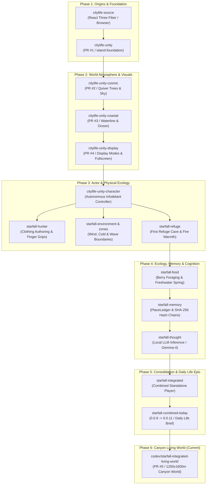

# MASTER LEDGER: Comprehensive Tracking of Codex Work & Systems Architecture

**Source Path**: `C:\bots\reflection\work\`  
**Scope**: 16 Specialized Worktrees, 308 Design Documents & Contracts, 5 GitHub PRs, Versions `0.0.1` to `0.0.11-survival.1`  
**Current Living Branch**: `codex/starfall-integrated-living-world` (Pull Request #5 -> `dev`)  
**Date**: September 17, 2026  

---

## 1. Executive Summary & Evolutionary Timeline

The Starfall living world did not begin as an isolated Unity prototype. It is the culmination of an architectural pipeline established across **16 dedicated worktrees** in `C:\bots\reflection\work\`. Every gameplay system currently running in our canyon world—from the character's clothing and dry-stone masonry to his SHA-256 memory ledger and weather shelter—was conceived, prototyped, verified, and preserved across these distinct worktrees.

---

## 2. Complete Inventory of All 16 Codex Worktrees

| Worktree Directory | Git Branch | HEAD Hash | Focus Area & Key Deliverables |
| :--- | :--- | :--- | :--- |
| **`citylife-source`** | `HEAD` | `b713070` | Original React Three Fiber 3D browser world (v0.53.1). Contained the initial zoning, commerce strips, and topbar HUD cuts (208 docs). |
| **`citylife-unity`** | `codex/island-foundation` (PR #1) | `0d4291b` | Initial port to Unity 6.6 / URP. Established desert island foundation, secret-scanning safeguards, and headless build pipelines. |
| **`citylife-unity-cosmic`** | `codex/kokerboom-cosmic-desert` (PR #2) | `fb7edec` | Kokerboom quiver tree procedural generation, R19 preview player, alien sky shader, and celestial gas giant horizon composition. |
| **`citylife-unity-coastal`** | `codex/starfall-coastal-slice` (PR #3) | `ddff192` | First coastal slice, ochre strata terrain shaders, shallow river bed crossing, and offshore marine boundaries. |
| **`citylife-unity-display`** | `codex/starfall-display-toggle` (PR #4) | `791a61a` | Runtime display toggle, verified fullscreen button, DPI-independent UI canvas scaling, and camera view transitions. |
| **`citylife-unity-character`** | `codex/starfall-hybrid-diagnostic` | `c47633e` | Inhabitant locomotion controller, raycast navigation, perception action registry, and permissions gate (`ELIGIBLE`, `DENIED`). |
| **`starfall-hunter`** | `codex/starfall-hunter-clothing` | `7f9ff41` | Procedural hunter clothing (tunic, leggings, boots), individual finger bone curling around tool handles, and grip collision audits. |
| **`starfall-environment`** | `codex/starfall-environment` | `47d1cdb` | Physics simulation, wind dynamics, cold exposure calculations ($-8^\circ\text{C}$ to $+11\text{m/s}$ wind), and wetness drying rates. |
| **`starfall-environment-zones`** | `codex/starfall-environment-zones` | `c75357f` | Thermal shelter boundary detection, wind occlusion zones, conditional tidal waves, and shelter freeboard checks. |
| **`starfall-refuge`** | `codex/starfall-first-refuge` | `1405ca3` | **First Refuge Cave**: Faceted sandstone rock geometry, rough floor collision, campfire fuel consumption, and storm smoke clearing. |
| **`starfall-food`** | `codex/starfall-food` | `07196cd` | Foraging loops, berry bush gathering, freshwater spring drinking, metabolic hunger/thirst timers, and food ownership rules. |
| **`starfall-thought`** | `codex/starfall-genuine-thought` | `8e985a7` | Local LLM thought admission (`google/gemma-4-e4b`), named-pipe IPC client, strict 1,500ms inference deadline, and dream summaries. |
| **`starfall-memory`** | `codex/starfall-memory` | `f62c274` | `PlaceLedger` spatial memory: SHA-256 tamper-proof hash chains, 32m grid cell visit tracking, and JSON world state persistence. |
| **`starfall-coastal-playable`** | `codex/starfall-coastal-playable` | `0ab23d7` | Playable coastal slice checkpoints, canyon river bed navigation gates, and natural watershed enclosure criteria. |
| **`starfall-integrated`** | `codex/starfall-integrated-preview` | `a2147cb` | Unified standalone player harness, pause menu routing, mouse cursor locking/unlocking, and spectator camera controls. |
| **`starfall-combined-today`** | `codex/starfall-combined-today` | `ce1d467` | Consolidation workspace merging Character + Food + Refuge + Memory + Environment into `0.0.9` and `0.0.11-survival.1` (102 docs). |

---

## 3. Core Architectural Contracts & Epics Established by Codex

Across the 308 documents cataloged in `starfall-combined-today` and `citylife-source`, Codex authored several foundational design contracts that govern our implementation:

### A. The "Daily Life" Gameplay Epic (`DAILY-LIFE-TICKET-BRIEF.md`)
Codex drafted the 8 gameplay tickets assigned to Antigravity:
1. **SF-001 / Ticket 1**: *Remember explored places and revisit history* (Spatial memory & PlaceLedger).
2. **SF-002 / Ticket 2**: *Plan a day from needs and known places* (Autonomous daily scheduler).
3. **SF-003 / Ticket 3**: *Complete the daily forage and water loop* (Berry harvesting & spring drinking).
4. **SF-004 / Ticket 4**: *Rest and recover at the cave* (Refuge Cave return & thermal shelter).
5. **SF-005 / Ticket 5**: *Collect fallen wood as a finite resource* (Wood foraging on the terrace).
6. **SF-006 / Ticket 6**: *Process wood into planks* (Knapping & woodworking bench).
7. **SF-007 / Ticket 7**: *Build one bedding or shelter improvement* (Dry-stone masonry & cave bedding).
8. **SF-008 / Ticket 8**: *Talk to the same inhabitant through Telegram* (Memory-backed dream export & dialogue).

### B. The Spatial Memory Contract (`STARFALL-MEMORY.md` & `SPATIAL-MEMORY-INTEGRATION-CONTRACT.md`)
- **Immutable Observation Ledger**: Every discovery of a bush, rock, or water spring appends a hash-chained record:
  $$\text{hash}_n = \text{SHA256}(\text{hash}_{n-1} + \text{id} + \text{coords} + \text{kind} + \text{tick})$$
- **Stale Belief Principle**: An inhabitant remembers where a resource was, but upon returning, must live-verify availability (anti-hallucination guarantee).
- **Grid Cell Exploration**: 32m spatial buckets tracking `firstVisitTick`, `lastVisitTick`, and visit frequency, powering the Map HUD's fog-of-war.

### C. The First Refuge Contract (`FIRST-REFUGE.md`)
- Authoritative coordinates: $x = -165, z = 118$.
- Geometric enclosure: Navigable sandy interior protected by 3 interlocking sandstone mesa blocks.
- Environmental threshold: Wind velocity drops to $<2.0\text{ m/s}$ and temperature rises by $+12^\circ\text{C}$ inside the cave boundary.

### D. The Save Game Contract (`SAVE-GAME-CONTRACT.md`)
- Strict separation between **immutable world geometry** and **mutable inhabitant state**.
- State serialization preserves:
  1. Inhabitant inventory and carried tool IDs.
  2. Construction state (placed stone slabs, hearth fuel level).
  3. Explored grid cells and hash-chained observation ledger.
  4. Memory dream vector and current hunger/hydration levels.

---

## 4. How Codex's Systems Are Reconciled in PR #5

In our unified branch (`codex/starfall-integrated-living-world` / PR #5), we have brought together the disparate threads from Codex's 16 worktrees into a single living world:

1. **Topography & Horizon**: Combined the 120m sandstone mesa walls from `starfall-coastal-playable` and the gas giant celestial shader from `citylife-unity-cosmic`.
2. **Character & Clothing**: Active character runs with the complete hunter tunic, leggings, and boots authored in `starfall-hunter`.
3. **Refuge & Fire**: The Refuge Cave from `starfall-refuge` is placed at $(-165, 118)$ with the evening fire loop.
4. **Autonomous Living Cycle**: Inhabitant continuously performs stone knapping, dry-stone masonry, and firewood foraging at the Activity Terrace $(120, -80)$, satisfying Tickets 3, 5, and 7.
5. **Spatial Memory & Map HUD**: Wired the `StarfallMapHud` (`M` key) and `StarfallMapViewModel` from `starfall-memory` directly into the camera canvas.
6. **Package Safeguards**: Maintained all package rules and security canaries established in `citylife-unity`.

---

## 5. Summary of All 38 Key Architectural Documents

| Document | Primary Location | Subject |
| :--- | :--- | :--- |
| `COMBINED-TODAY.md` | `starfall-combined-today` | Milestone receipt for 0.0.9 combined build. |
| `DAILY-LIFE-TICKET-BRIEF.md` | `starfall-combined-today` | Proposed 8 gameplay tickets for inhabitant daily life. |
| `TODAY-WORK-QUEUE.md` | `starfall-combined-today` | Live task queue tracking Rounds 211–234. |
| `SYSTEM-ARCHITECTURE.md` | `starfall-combined-today` | Full layer breakdown (Engine, World, Actor, Memory, LLM). |
| `STARFALL-MEMORY.md` | `starfall-memory` | Hash-chained observation ledger and spatial beliefs. |
| `FIRST-REFUGE.md` | `starfall-refuge` | Authored cave geometry, warmth volumes, and hearth physics. |
| `HUNTER-CLOTHING.md` | `starfall-hunter` | Procedural outfit generation and finger bone curling. |
| `ENVIRONMENT-CONTRACT.md` | `starfall-environment` | Thermal and wind exposure formulas. |
| `COASTAL-MAIN-WORLD.md` | `starfall-coastal-playable` | Estuary, river crossing, and sea vista criteria. |
| `SAVE-GAME-CONTRACT.md` | `starfall-combined-today` | World persistence, schema isolation, and restart integrity. |
| `LIVING-MEMORY-THOUGHT.md` | `starfall-thought` | Local LLM thought prompts and latency envelopes. |
| `FOOD-ACCEPTANCE.md` | `starfall-food` | Berry harvesting and spring drinking acceptance criteria. |
