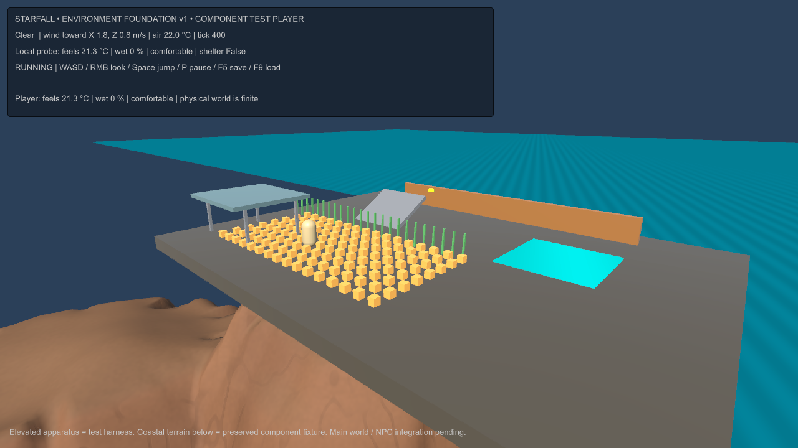
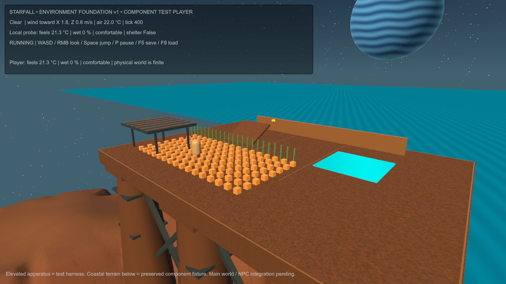

# Supported Starfall test terrace

The suspended slab presentation has been replaced by an engineered sandstone terrace: six tapered piers meet the existing coastal heightfield, dark braces carry the spans, ochre inlays mark the test deck, and the shelter shares the structural palette. Warm stone, cool metal, a procedural blue gas giant and weather-dimmed stars bring the fixture into Starfall's visual direction.

The new structure is presentation geometry. It adds no colliders or walkable surfaces, preserving every existing collision condition and deterministic test position. The supports therefore remain visual fixtures, not newly accepted player-traversable architecture. The original apparatus, material-independent physics, terrain, force model, clocks and automated probes remain intact.

## Matching actual-player comparison

Both images are captured from compiled Windows players at 1280x720 with the same camera, clear-weather tick 400, 128 bodies and a 512-sample precipitation pool. Neither image is generated concept art or an editor render.

Before: accepted physics/performance baseline, preserved at commit `ff5edad`.

After: supported terrace presentation revision `starfall.environment-terrace.v1`.

Additional actual-player states: [rain](../evidence/milestones/environment-terrace/rain.png), [cold and shelter response](../evidence/milestones/environment-terrace/cold.png), [storm](../evidence/milestones/environment-terrace/storm.png). The fixed comparison camera preserves inspectability of the apparatus; its lower crop does not show every pier footing.

## Validation

| Claim | Status | Evidence | Remaining gap |
|---|---|---|---|
| Test positions and collision conditions preserved | PASS | [Before/after collision fingerprint](../evidence/verified/environment-terrace/presentation-manifest.json) matches exactly; no new colliders | Render-only supports do not establish physical architecture acceptance |
| Original probes and physical measurements preserved | PASS | [Comparison](../evidence/verified/environment-terrace/comparison.json): all five model/motion/check files unchanged; all 20 physics measurements match baseline with maximum difference 0 | Cross-machine determinism remains unverified |
| Compiled-player behavior | PASS | [Full report](../evidence/verified/environment-terrace/player-report.json): 12,410 model assertions, 20 physical checks, all eight acceptance flags | Main-world integration and direct input-device acceptance remain open |
| Original performance budget retained | PASS | 1,923 frames over 32.060 s; p95 16.761 ms, p99 16.983 ms; 128 bodies/512 precipitation capacity; every frame 1280x720 | One revised 32-second fixture run; no long main-world soak claim |
| Accepted baseline preserved | PASS | [185 accepted environment-build files unchanged](../evidence/verified/environment-terrace/baseline-preservation.json); prior evidence remains in its original folders | Other workstreams not changed by this revision |

New executable: `Builds/Environment-20260913-154950/StarfallEnvironment.exe`; [build report](../evidence/verified/environment-terrace/build.json) records success with zero errors. Retained [frame CSV](../evidence/verified/environment-terrace/frame-times.csv) supports the timing results. The earlier fixture and its two accepted stress runs remain available unchanged.

The initial presentation compile caught use of an obsolete Unity object-ID method; it was corrected before the successful build. No physical-model change was needed. This remains a local, unpushed workstream; no merge, deployment, service change or user approval of the visual result is inferred.
