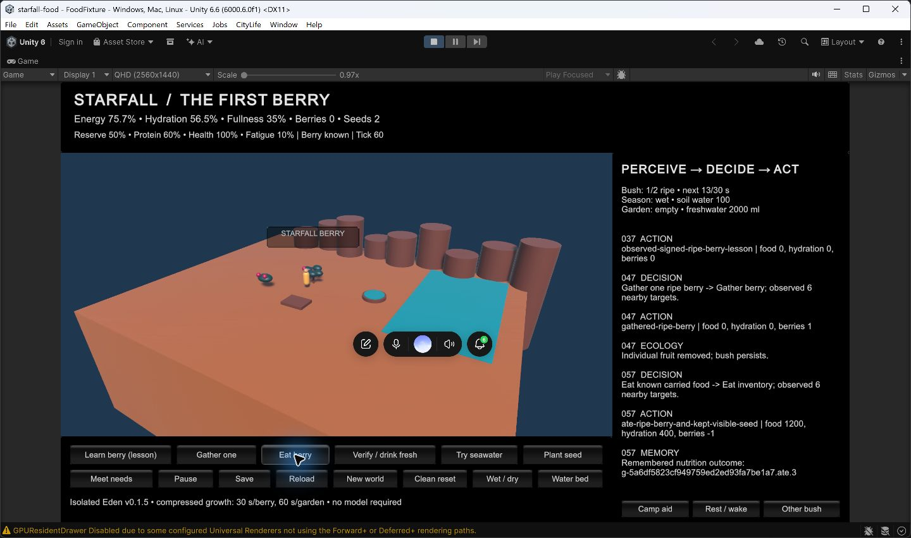

# Food v0.1.5: Editor visual/input acceptance and isolated handoff

The opaque HUD passes the native visual/input gate in the trusted Unity Editor. **This is Editor runtime evidence, not standalone-player acceptance.** The blocked standalone candidate and Code Integrity evidence remain preserved. Smart App Control was not changed.

The image is an actual Editor capture, not concept art. A desktop voice overlay partly covers the world; the food HUD and controls remain visible. Initial asynchronous shader compilation briefly showed cyan surfaces; the retained checkpoints were captured after normal materials appeared. Final art and human gameplay acceptance are separate.

| Claim | Status | Evidence | Remaining gap |
|---|---|---|---|
| Exact food runtime exercised | PASS | [Source comparison](../evidence/milestones/food/editor-v015/source-equivalence.json): Editor head `4ab8523` has unchanged runtime source from blocked candidate `8f79083` | Editor-only opener and docs differ |
| World viewport and corrected HUD | PASS in Editor | [Unknown](../evidence/milestones/food/editor-v015/01-editor-unknown.png), [known](../evidence/milestones/food/editor-v015/02-editor-lesson.png), [meal](../evidence/milestones/food/editor-v015/04-editor-meal.png) | Standalone rendering unverified under current signing policy |
| Native lesson/gather/eat | PASS in Editor | [Input report](../evidence/milestones/food/editor-v015/editor-input-report.json): lesson tick 37; gather +1 berry tick 47; eat -1 berry, +1200 energy, +400 hydration tick 57 | No claim of broad device or human acceptance |
| Native pause/save | PASS in Editor | [Visible save receipt](../evidence/milestones/food/editor-v015/05-editor-native-save.png), tick 69; immutable snapshot retained locally | Existing reload suite retained, not repeated |
| Prior gameplay behavior | Retained PASS, v0.1.2 | [79 loop/model checks](../evidence/milestones/food/editor-v015/prior-v012-loop-report.json), [separate reload](../evidence/milestones/food/editor-v015/prior-v012-relaunch-report.json), [six Eden checks](../evidence/milestones/food/editor-v015/prior-v012-eden-report.json), [six synthetic mortality checks](../evidence/milestones/food/editor-v015/prior-v012-mortality-report.json) | These are historical standalone results, not new v0.1.5 standalone tests |
| Preservation | PASS | [929 prior files unchanged and blocked-player hash](../evidence/milestones/food/editor-v015/preservation.json); eight preparation files restored; clean checkout after exit | None for the recorded comparison |
| Standalone distribution | BLOCKED | [Windows policy block](FOOD-VISUAL-BLOCKER.md) and [trusted signing requirements](FOOD-STANDALONE-SIGNING.md) | Proper signing, then real protected-machine launch/input acceptance |
| Combined-world integration | NOT PERFORMED | [Exact adapter contract](FOOD-INTEGRATION.md) | Reviewed dependency-ordered integration and authoritative review receipts; no merge or release claimed |

Native actions used `@oai/sky` against the uniquely selected `starfall-food - FoodFixture` Unity window. Play Mode was started and stopped with its toolbar. Lesson, gather, eat, pause and save used visible pointer targets. The owned Editor process exited before the slot/surface was released. Local raw evidence is `evidence/local/editor-visual-20260914-063329/`; private saves and raw decision logs remain ignored. The reviewed milestone folder contains only screenshots and scoped reports.

Repository verification also passed: `tools/check-project.py` (897 publishable files, 132 unique Unity GUIDs, 20 verified inherited CC0 art records), syntax checks for 11 PowerShell scripts, `git diff --check`, and Gitleaks 8.30.1 over 149 reachable commits plus publishable files. These are repository checks, not additional runtime acceptance; the scan log remains in the local evidence directory.

The read-only registry observation `VerifiedAndReputablePolicyState=1` records SAC configured On. The optional `CiTool -lp` query returned access denied; it was not escalated. Earlier Code Integrity enforcement events remain the standalone-block evidence. [Microsoft mode definitions](https://learn.microsoft.com/en-us/windows/apps/develop/smart-app-control/test-your-app-with-smart-app-control)

## Handoff boundary

The local component can now be reviewed with its Editor visual/input evidence. Integrate only the authority/model/ecology/physiology contracts after review; the fixture must not replace the combined-world bootstrap. This branch has no PR as of the recorded `gh pr list` inspection. No remote review acceptance, Live Brief receipt, merge, deployment or release is claimed. The queue owner must map the real workstream identifiers and route an authorized exact remote head through protected review when publication/integration is approved.

For another Editor check, exclusively reserve both the Editor and native surface, preserve preparation-touched files, and launch the installed `6000.6.0f1` Editor with `-projectPath <isolated checkout> -executeMethod Starfall.Food.Editor.FoodBuild.OpenForPlayMode -foodEvidence <new evidence directory> -logFile <editor log>`. Use the native Play toolbar and retain the Editor frame in captures. Close the owned Editor and restore preparation backups before release. This route does not launch or repurpose the blocked standalone executable.
