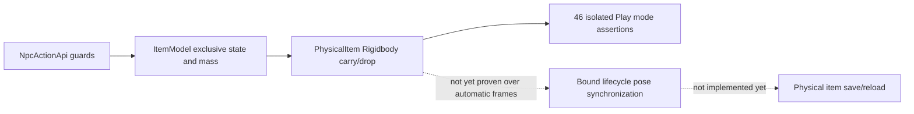

# Physical Items: Foundation Slice Source Note

Authoritative Task: `4279edae-3f78-4c74-843a-c67489749451`  
Component Namespaces: `CityLife.Items`, `CityLife.World`  
Milestone: Living, Physical World (Bounded Vertical Slice: Action Adapter & Physics Runtime)  
Status: Source authored; repairs applied; 58 component checks verified in pinned Unity run02; comprehensive runtime suite (45 checks) awaiting coordinator execution; task IN_PROGRESS  

---

## 1. Overview & Architectural Boundaries

This document records the physical item foundation and runtime action adapter slice in Kooker: Starfall.
Per the project architecture and task requirements:
- Action mutations pass strictly through `CityLife.World.NpcActionApi`, extended to support `NpcActionKind.Drop` and physical item lifecycle transitions.
- A trusted Unity adapter component (`CityLife.Items.PhysicalItem`) bridges Unity engine physics (`Rigidbody`, `Collider`) to the deterministic `CityLife.Items.ItemModel`.
- A configured `PhysicalModel` is strictly required for every `PhysicalItem`; legacy fallback is preserved only for truly non-physical interactables.
- Validation is strictly read-only: `PhysicalItem.IsValid()` does not silently clamp mass or mutate colliders; invalid or mismatched configurations fail closed before any model or Unity mutation.
- During carry, velocities are zeroed while dynamic, then the body is switched to kinematic carry with a trigger collider parented to the actor hand.
- Upon drop, `Held.Permission`, active/enabled status, world/scene, ownership, and carried state are revalidated before release.
- Release clearance evaluates full configured collider geometry and the swept path from held pose to runtime release pose, failing closed on overflow or invalid physics scene.
- Dynamic physics (`isKinematic = false`, `useGravity = true`) is restored before zeroing velocities on release, with continuous dynamic collision detection and solid enabled colliders configured deterministically.
- In-flight or settled resting transforms are synchronized back to the model authoritatively via `ItemModel.SyncFreeTransform(worldId, generationId, itemId, position, rotation)`.
- Runtime moving bodies continuously update their authoritative pose via `phys.SyncToModel()` in `FixedUpdate()`, matching body pose during movement and after settling.
- Legacy `Deliver` to destination sockets explicitly denies physical items (`"physical-delivery-not-supported-in-slice"`), preventing desynchronization with legacy transform sockets.
- Non-physical interactable pickup and delivery behavior in `NpcActionApi` is completely preserved without regression.
- No second live inventory exists in runtime. Food inventory scalar migration, persistence, and normal canyon player integration remain explicit future work.

---

## 2. Implemented Source Components

### `Assets/CityLife/Items/ItemDefinition.cs`
- **`PhysicalDimensions`**: Represents 3D bounding extents in metres (`width`, `height`, `depth` > 0 and finite, up to 20m), computing volume in m³.
- **`ItemDefinition`**: Declares immutable physical metadata:
  - Stable type identifier (`itemTypeId`).
  - Sensible finite positive mass in kilograms (`massKg` > 0 and finite, up to 10,000 kg).
  - Container attributes (`isContainer`, `maxContainedMassKg`, `maxContainedVolumeM3`, `maxContainedSlots`).
  - Anchoring flag (`isAnchored`) for scenery and immovable fixtures.
  - Placement requirement (`requiresSupportToPlace`).
  - Copy constructor and `Clone()` preventing caller aliasing.
  - **Canonical Rotation Ingress Rule**: `TryCanonicalizeRotation(Quaternion q, out Quaternion normalized)`. Strictly rejects zero, near-zero, non-unit, NaN, and infinity quaternions, canonicalizing valid near-unit quaternions to exact unit length.

### `Assets/CityLife/Items/ItemState.cs`
- **`ItemLocationKind`**: Explicit, mutually exclusive item states:
  - `Free`: Unattached in the world, unheld, uncontained, awaiting or subject to physics.
  - `Carried`: Held by an actor (single authoritative owner `holderActorId`).
  - `Stored`: Contained inside a container item (`containerItemId`).
  - `Placed`: Rested or mounted on a supported surface or socket (`placedSupportId`).
  - `Anchored`: Permanently fixed scenery/terrain fixture (cannot be picked up).
- **`ItemStateSnapshot`**: Thread-safe, deep-cloned state snapshot enforcing single ownership/container invariants, canonical rotation verification, and finite transform vectors.

### `Assets/CityLife/Items/ItemModel.cs`
Authoritative deterministic model managing item registration, hierarchy, and atomic state transitions:
- **Identifier Validation**: Enforces alphanumeric/dot/underscore/dash identifiers (`IsValidId`) up to 80 characters.
- **Action Ingress & Replay Identity**: Evaluates `ItemActionRequest` (`Pickup`, `Drop`, `Place`, `Store`, `Retrieve`).
  - Constructs canonical semantic request signatures (`BuildRequestSignature`).
  - Ingress ledger (bounded to 512 receipts) returns idempotent receipts on identical replay (`duplicate = true`), rejecting conflicting payloads under the same `requestId`.
- **Nested Containers & Contained Mass**:
  - Recursive traversal with visited set to guarantee single-count mass accounting.
  - Ancestor container capacity validation on `Store`.
  - Accurate net mass change accounting on `Retrieve`.
- **Authoritative Free Transform Sync**:
  - `SyncFreeTransform(string worldId, string generationId, string itemId, Vector3 position, Quaternion rotation)`: Narrowed to trusted adapter access with strict world, generation, and identity validation.
  - Strictly rejects updates for items that are `Carried`, `Stored`, `Placed`, or `Anchored`, or containing NaN/Inf or non-canonical rotations.

### `Assets/CityLife/Items/PhysicalItem.cs`
Unity runtime MonoBehaviour bridging game objects to the physical item architecture:
- Caches and manages `Rigidbody` and `Collider`.
- **Explicit Setup**: `ConfigureComponents()` sets up components without silently clamping mass.
- **Binding**: `Bind(ItemModel model, string worldId, string generationId)` and `IsBoundTo(...)` ensure only registered, bound items can mutate model state.
- **Read-Only Validation**: `IsValid()` checks identifiers, declared mass matching body mass without clamping, dimensions, enabled collider, unit lossy scale, supported single non-compound collider, and continuous dynamic detection mode.
- **Physics Transitions**:
  - `AttachToHand(Transform hand)`: Clears velocities while dynamic, switches to kinematic carry, enables trigger collider, parents to hand at `(0.06, 0.04, 0.0)`, and marks carried.
  - `ReleaseToPhysics(Vector3 releasePos, Quaternion releaseRot)`: Unparents, restores dynamic physics before zeroing velocities on release, restores non-trigger solid collider, and sets continuous dynamic collision detection.
- **Continuous Transform Sync**: `SyncToModel()` verifies free, dynamic, bound, unanchored state and forwards body pose to `ItemModel.SyncFreeTransform`. Invoked automatically in `FixedUpdate()`.

### `Assets/CityLife/Scripts/NpcActionApi.cs`
Action mutation boundary updated with physical item support:
- `NpcActionKind`: Extended to `{ Pickup, Deliver, Drop }`.
- `PhysicalModel` & `PhysicalAuthority`: Required for all physical item interactions; legacy path preserved only for non-physical objects.
- **Metadata Validation**: `ValidatePhysicalMetadata` validates physical item component, binding, stable ID, registration, definition existence, and exact matching of `itemTypeId`, `massKg`, `dimensions`, and `isAnchored` before any mutation.
- **Drop Action**:
  - Revalidates `Held.Permission`, active/enabled status, world/scene, hand ownership, model carried state, and target ID match.
  - Computes hand-derived release pose (`hand.position + hand.forward * 0.25f`). No stale ground Approach gate.
  - Performs full configured collider release geometry check and swept path check (`BoxCast`/`SphereCast` and `OverlapBox`/`OverlapSphere` with 32-hit buffer and overflow detection).
  - Executes model state transition and dynamic physics release without partial mutation on failure.
- **Pickup Action**:
  - Validates physical items against model metadata, rejects anchored items, executes model pickup, and attaches kinematically to hand.
- **Deliver Action**:
  - Explicitly denies delivery with `"physical-delivery-not-supported-in-slice"` when the held item has a `PhysicalItem` component.
- **SyncFreeTransform**:
  - `SyncFreeTransform(string itemId)` verifies registry presence, active/enabled status, world/scene match, bound physical item, and delegates to `phys.SyncToModel()`.

---

## 3. Check Suites & Verification Architecture

### Component In-Memory Suite (`Assets/CityLife/Items/ItemChecks.cs`)
58 deterministic, pure C# in-memory check assertions:
- Ingress/egress aliasing protection.
- Canonical rotation normalization and rejection of non-unit/degenerate/NaN quaternions.
- Replay identity, receipt caching, and conflict rejection.
- Nested container capacity, ancestor chains, and mass calculations.
- Containment cycle rejection.
- Anchored scenery immutability.
- Placement authority delegation and denial.

### Isolated Scene Physics Runtime Suite (`Assets/CityLife/Items/Editor/PhysicalItemRuntimeChecks.cs`)
Runs within an isolated physics scene (`LocalPhysicsMode.Physics3D`) stepped synchronously via `physics.Simulate(0.02f)` across non-overlapping, spatially isolated fixtures:
1. `nonphysical-pickup-regression`: Verifies legacy interactable pickup works without regression.
2. `nonphysical-deliver-regression`: Verifies legacy interactable delivery into destination socket works without regression.
3. `physical-pickup-denied-when-missing-model`: Denies physical pickup when `PhysicalModel` is null.
4. `physical-pickup-denied-when-world-mismatch`: Denies pickup when object `WorldId` does not match API.
5. `physical-pickup-denied-when-los-blocked`: Denies pickup when solid obstacle blocks line of sight.
6. `physical-pickup-denied-when-anchored`: Rejects picking up anchored fixtures.
7. `physical-pickup-denied-when-out-of-reach`: Rejects pickup when actor is beyond reach tolerance.
8. `physical-pickup-denied-when-carry-mass-exceeded`: Rejects pickup when item exceeds actor carry mass budget.
9. `physical-pickup-denied-when-metadata-mismatched`: Rejects pickup when component mass does not match definition.
10. `physical-pickup-denied-when-unsupported-scale`: Rejects pickup when transform scale is non-unit.
11. `physical-pickup-denied-when-permission-revoked`: Rejects pickup when interactable permission is false.
12. `physical-pickup-attaches-to-hand-kinematic`: Kinematically attaches to hand with trigger collider.
13. `physical-pickup-updates-model-state`: Updates `ItemModel` state to `Carried`.
14. `physical-pickup-denied-when-hands-full`: Prevents picking up multiple items simultaneously.
15. `physical-delivery-denied-for-physical-item`: Denies legacy socket delivery for physical items.
16. `physical-drop-denied-when-permission-revoked-after-pickup`: Denies drop if permission revoked while held, preserving cargo in hand.
17. `physical-drop-denied-when-world-mismatched-after-pickup`: Denies drop if world ID modified while held.
18. `physical-drop-denied-when-full-shape-edge-collides`: Denies drop when full-shape box edge collides with obstacle even though center is clear.
19. `physical-drop-denied-when-swept-path-blocked`: Denies drop when obstacle obstructs swept path from held pose to release pose.
20. `physical-drop-denied-when-permission-denied`: Denies drop when `AllowDrop` is false.
21. `physical-drop-denied-when-target-id-mismatched`: Denies drop when target ID does not match held cargo.
22. `physical-drop-releases-to-physics-dynamic`: Restores dynamic Rigidbody, gravity, and continuous dynamic collision detection.
23. `physical-drop-position-at-hand-release-pose`: Verifies unparented world transform matches hand forward offset.
24. `physical-drop-updates-model-to-free`: Updates `ItemModel` state to `Free`.
25. `physical-drop-idempotency-replay-before-move`: Replay immediately after drop returns duplicate receipt without mutating state.
26. `physical-falling-accelerates-under-gravity`: Verifies acceleration under world gravity ($g = 9.81\text{ m/s}^2$).
27. `physical-moving-body-syncs-authoritative-pose`: Verifies model transform updates continuously during flight.
28. `physical-settling-achieved-within-5s`: Verifies item settles within the 5.0s budget.
29. `physical-settling-time-budget`: Measures settling elapsed time $\le 5.0\text{ s}$.
30. `physical-settled-linear-speed-tolerance`: Settled linear speed $\le 0.03\text{ m/s}$.
31. `physical-settled-angular-speed-tolerance`: Settled angular speed $\le 0.052\text{ rad/s}$ ($3.0^\circ/\text{s}$).
32. `physical-penetration-within-tolerance`: Penetration depth measured with `Physics.ComputePenetration` $\le 0.01\text{ m}$.
33. `physical-rest-drift-within-budget-30s`: Resting drift observed over full 30.0s (1500 steps) $\le 0.02\text{ m}$.
34. `physical-drop-replay-after-settle-does-not-teleport`: Replay of drop request post-settling does NOT teleport settled body back to drop pose.
35. `physical-drop-conflict-preserves-state`: Same request ID with different payload returns `"request-id-conflict"` and preserves state.
36. `sync-free-transform-authoritative-update`: `SyncFreeTransform` synchronizes settled transform to model.
37. `synced-item-matches-settled-transform`: Model snapshot matches actual settled position.
38. `impostor-object-cannot-sync-state`: Unregistered, un-bound impostor object with same ID fails to mutate model state.
39. `impostor-attempt-preserved-model-state`: Model transform verified unchanged after impostor sync attempt.
40. `re-pickup-of-settled-physical-item`: Actor navigates to settled position and picks up the item again.
41. `sync-free-transform-rejects-carried-item`: Rejects syncing transform while item is `Carried`.
42. `sync-free-transform-rejects-anchored-item`: Rejects syncing transform for anchored items.
43. `sync-free-transform-rejects-nan-position`: Rejects NaN/Inf coordinate inputs.
44. `sync-free-transform-rejects-zero-quaternion`: Rejects unnormalized zero quaternions.
45. `sync-free-transform-rejects-world-mismatch`: Rejects updates with mismatched world ID.
46. `sync-free-transform-rejects-generation-mismatch`: Rejects updates with mismatched generation ID.

### Unified Editor Validation Runner (`Assets/CityLife/Items/Editor/PhysicalItemValidation.cs`)
```powershell
# Invocation by the coordinator running the pinned Editor in batch mode:
Unity.exe -batchmode -nographics -projectPath <checkout-path> `
  -executeMethod CityLife.Items.Editor.PhysicalItemValidation.Run `
  -physicalItemEvidence <absolute-output-directory> `
  -logFile <log-path>
```
*Note: Do not pass `-quit` on the command line; the harness deliberately enters play mode in an empty unsaved fixture scene, executes the suite, exits play mode, and calls `EditorApplication.Exit()` with the verified exit code.*
- **Zero `delayCall` Dependency**: State machine transitions and suite execution are driven exclusively by guarded `EditorApplication.update` and `EditorApplication.playModeStateChanged`, immunizing the harness against unhandled exceptions in external delay callbacks (e.g. Unity search indexers).
- **Exact-Once Execution**: Guarded by `SessionState` (`ActiveKey`, `ExecutedKey`, `StageKey`) to prevent double-execution or re-triggering across domain reloads or unrelated editor sessions.
- **Empty Fixture Scene**: Enters play mode using an empty unsaved scene (`EditorSceneManager.NewScene(NewSceneSetup.EmptyScene, NewSceneMode.Single)`), completely bypassing standard world bootstrap, terrain streaming, or LLM services.
- **Stage Evidence Flushing**: Flushes stage transitions (`launch`, `entering-play`, `entered-play`, `component-start`, `component-done`, `runtime-start`, `runtime-done`, `leaving-play`, `exited`) directly to `<output-directory>/stages.txt` with UTC timestamps.
- **120-Second Internal Watchdog**: Monitored via `EditorApplication.update` against `EditorApplication.timeSinceStartup`. On stall or transition timeout, writes stalled stage and partial counts to `failed.txt` and `summary.json`, records `failed` stage, and terminates via `EditorApplication.Exit(1)`.
- **Partial Count Reporting**: Writes `passed.txt` with partial assertions passed if a failure occurs during execution, plus component and runtime counts in `summary.json`.
- **Deterministic Exit**: Exits play mode via `EditorApplication.isPlaying = false` and terminates the Editor process with code 0 on pass or 1 on failure.

---

## 4. Verification Evidence & Status

- **Component Verification**: 58 in-memory checks verified in pinned Unity 6000.6.0f1 (exit 0, `passed.txt` SHA256 `D6AEDFD3EC6D25B1DCE16FD0230423C89DDA7DBF111AFD2B001D35819A05932F` in run02; 58 PASS confirmed in run05).
- **Harness Verification**: Run05 confirmed full, clean Play Mode lifecycle with guarded `EditorApplication.update`/`playModeStateChanged` state machine, flushing `launch -> entering-play -> entered-play -> component-start -> component-done -> runtime-start -> leaving-play -> exited` without hanging.
- **Runtime Fixture Repair**: Repaired `depot-dest` fixture position (~0.394m <= 0.65m), added distinct reachable target for `hands-full` assertion, isolated falling wood contact zones, froze unrelated dynamic fixtures prior to physical settling simulation, and enriched all action assertions with actionable failure diagnostics (actual result code, success/duplicate status, approach distance, sight distance).
- **Current Status**: Source-pending verification. Fixture repairs complete, awaiting coordinator execution of `PhysicalItemValidation.Run()`. Task remains `IN_PROGRESS`.

---

## 5. Precise Remaining Gaps (Deferred Scope)

1. **Standalone Player Verification**: This slice proves editor-executable physics scene simulation. Running inside the normal compiled canyon player with native player controls, visual rendering, and input devices remains unexecuted and unverified.
2. **Save/Load & Persistence Reconciliation**: Serializing physical item instances, container trees, and in-flight action state across save game boundaries.
3. **Food Inventory Migration**: Converting scalar counters (`carriedFruit`, `seeds`) in `FoodModel` to physical item definitions and instances.
4. **Visual & Art Integration**: Visual hand grip positioning for specific character skeleton rigs, container meshes for cave refuges, and collision audio.
5. **Multi-Body Stress Performance**: Verifying frame budget ($p_{95} \le 4.0\text{ ms}$) under 100+ dynamic bodies on pinned reference hardware.

## Verified isolated physical Play mode checkpoint — 16 September 2026

Task4279 remains IN_PROGRESS. Pinned Unity6000.6.0f1 run06 exited0 with104 checks:58 model and46 local PhysicsScene assertions. Stages confirm actual Play mode; eight tested source hashes remained unchanged. passed.txt SHA256: `6D6D317A624E9A88BF44D075BDFDC9709B192728E4CE56E7FC391ED34116B2EF`.



| Claim | Status | Evidence | Remaining gap |
|---|---|---|---|
| Guarded pickup/drop, gravity, contact and settling | Isolated Play mode tested | run06:104 total,46 physics; full30s drift; request replay/denial cases | Automatic lifecycle binding, normal inhabitant/world demonstration |
| Physical delivery/storage | Explicitly unsupported in current slice | Suite retains physical-delivery denial assertion | Supported placement/storage/retrieve and container integration |
| Persistence and normal-player installation | Unverified/not delivered by this checkpoint | No player built for this physical source | Versioned item persistence, restart invariants and actual-player media |

The suite uses synchronous simulation and explicit synchronization calls; it does not prove natural FixedUpdate scheduling. Earlier run03 edit-mode failure, run04 cancelled Editor callback session and run05 unreachable fixture failure are retained as diagnostics. No thresholds were increased to pass the fixture. This checkpoint is not a release or user acceptance.

---

## 6. Live In-World Foundation Integration

### Architectural Summary
- **Bootstrap Component (`Assets/CityLife/Items/PhysicalItemBootstrap.cs`)**:
  - Attached to the canyon inhabitant in `IntegratedCoastalBuild.Attach` via minimal 2-line wiring with an explicit integration note.
  - Instantiates authoritative `ItemModel` and `BasicItemActionAuthority` upon `Awake()`, configuring `ItemDefinition` via declared field initializers.
  - Re-binds `PhysicalModel` and `PhysicalAuthority` whenever `NpcAutonomy.ResetState()` recreates `Actions = new NpcActionApi(...)`.
  - Continuous synchronization in `FixedUpdate()`: `PhysicalItem.FixedUpdate` removed to eliminate duplicate or arbitrary sync; single trusted normal-frame path in `PhysicalItemBootstrap.FixedUpdate()` validates reference equality (`DemonstrationItem.gameObject == DemonstrationInteractable.gameObject`), scene validity, actor scene match, and world scope, delegating to `Brain.Actions.SyncFreeTransform(DemonstrationItemId)`.
- **Dedicated Movable Demonstration Item (`canyon-artifact-01`)**:
  - Authored within natural reach ($0.42\text{ m}$ ahead of inhabitant spawn) with stable type `"canyon-stone"`, mass $2.5\text{ kg}$, dimensions $(0.25\times 0.25\times 0.25\text{ m})$.
  - Configured with single `BoxCollider`, unit lossy scale ($1.0, 1.0, 1.0$), and continuous dynamic `Rigidbody`.
  - Layer 0 (Default) isolation: excluded from courier perception (Layer 11) and LOS raycast (Layers 8|10). Additionally, `NpcActionApi` explicitly distinguishes target/actor colliders from genuine occluders, preventing self-occlusion.
  - **Registry Separation**: The demonstration item is NOT appended to `Brain.Registry`, keeping legacy courier delivery prerequisites completely intact for `NpcAutonomy` and `StarfallSurvivalAutonomy`. `NpcAutonomy` exposes `AllInteractables` to supply both `Registry` and `DemonstrationInteractable` to `NpcActionApi`.
- **In-World Diagnostic Coroutine (`RunInWorldDiagnostic`)**:
  - Opt-in command-line arguments: `-physicalInWorldDiagnostic`, `-physicalEvidence <dir>`.
  - Runs in the live canyon world using ordinary Unity `FixedUpdate` scheduling (zero manual `PhysicsScene.Simulate`, zero manual `SyncToModel` in proof).
  - Waits boundedly (up to 100 ticks) for inhabitant readiness, then captures `wasRunning = Brain.Running` and pauses autonomy so the inhabitant remains at its authored spawn point, restoring `wasRunning` in `finally`.
  - Verifies reach ($\le 0.65\text{ m}$) honestly without repositioning or teleportation.
  - Mints monotonic action sequence IDs via `Brain.ExecutePlayerAction(NpcActionKind.Pickup / Drop, ...)`.
  - Settling budget: $\le 5.0\text{ s}$ (250 ticks). Enforces exact foundation thresholds: linear speed $\le 0.03\text{ m/s}$ and angular speed $\le 3.0^\circ/\text{s}$ ($0.05236\text{ rad/s}$) held continuously for 10 ticks.
  - Post-settle drift observation: $\le 0.02\text{ m}$ over $2.0\text{ s}$ (100 ticks).
  - Emits stage progression and writes `summary.json` / `passed.txt` without swallowing file system exceptions.
- **Player Controls (`Assets/CityLife/Scripts/NpcPlayerControls.cs`)**:
  - Bound to `G` key: gated strictly to `Brain.Possessed` and physical item scope (never drops legacy courier cargo).
  - If holding a physical item: calls `Brain.ExecutePlayerAction(NpcActionKind.Drop, Held.StableId)`.
  - If hands are free: checks candidate physical interactable reach ($\le 0.65\text{ m}$) and calls `Brain.ExecutePlayerAction(NpcActionKind.Pickup, candidate.StableId)`.
  - Fully documented in the in-game Controls pause menu.
- **Scale-Neutral Kinematic Grip Follower (`PhysicalItem.cs`)**:
  - Implements scale-neutral kinematic carry tracking: unparents the item to root level (`transform.SetParent(null, true); transform.localScale = Vector3.one;`), holding reference to `CarriedHand = hand;`.
  - Solves non-uniform avatar scale inheritance (`1.15, 1.0, 1.08` plus animated bone rotation shear on the hunter rig), guaranteeing exact unit world scale (`lossyScale == Vector3.one`) throughout carry and release without weakening `IsValid()`.
  - Snaps grip pose via `UpdateGripPose()` (`hand.TransformPoint(GripLocalOffset)` and `hand.rotation * GripLocalRotation`) in `AttachToHand()`, `LateUpdate()`, `FixedUpdate()`, and immediately before drop clearance validation.
  - Release to dynamic physics (`ReleaseToPhysics`) preserves unit scale and declared metre collider dimensions without any scale jump.
  - Authoritative attachment contract: `woodPhys.CarriedHand == handGo.transform && woodPhys.IsCarried` (unparented from hand). Legacy non-physical cargo parenting (`cargo.transform.parent == hand`) remains completely intact.
  - Concise diagnostic reporting: `GetDiagnosticMeasurements()` captures `(lossyScale, bodyMass, colliderBounds)` on failure in `NpcActionApi` and `PhysicalItemBootstrap`.
- **Preserved Boundaries**:
  - All 104 isolated checks (58 component in `ItemChecks.cs` + 46 runtime in `PhysicalItemRuntimeChecks.cs`) remain untouched in count and intent, updated to verify scale-neutral follower and dimensional conservation under the non-uniform animated hunter rig hierarchy.
  - `HunterClubCarry` and hunter outfit remain completely unaffected on the left hand.
  - Food model, survival autonomy, terrain streaming, and memory export sources remain untouched.
  - Deferred scope: multi-item inventory storage, crafting, and general container hierarchies remain separate subsequent work.

---

## 7. Restart Persistence Architecture & Separate-Process Protocol

### Architectural Summary
- **Envelope & Integrity (`Assets/CityLife/Items/ItemPersistence.cs`)**:
  - Schema: `starfall.physical-save.v1`.
  - SHA-256 payload integrity hash computed over normalized JSON content.
  - Bounded envelope budget $\le 1\text{ MB}$ (`MaxFileSizeBytes = 1048576`).
  - Scoped strictly to `(worldId, generationId, actorId, tick)`.
- **Durable Atomic Write (`SaveAtomic`)**:
  - Enforces explicit absolute paths (`Path.IsPathRooted`).
  - Pre-validates bounded payload before serialization (valid identifiers, tick $\ge 0$, items $\le 1000$, receipts $\le 512$).
  - Writes to temporary sibling file (`path + ".tmp-" + Guid`), calls `FileStream.Flush(true)` (`fsync`), and atomically replaces via `File.Replace(tmp, path, path + ".bak")` or `File.Move(tmp, path)`.
  - Retains prior save file in `.bak`; never corrupts existing saves on failure.
- **Strict Atomic Rejection (`TryLoad`)**:
  - Missing file returns `false` cleanly without throwing (fresh start behavior).
  - Malformed/truncated JSON or SHA-256 mismatch rejects without mutating runtime.
  - Foreign `worldId`, `generationId`, or `actorId` rejects atomically.
  - Non-finite mass or non-positive/NaN dimensions reject atomically without bypassing `Mathf.Abs` comparisons.
  - Negative or future `lastUpdatedTick` (`lastUpdatedTick < 0 || lastUpdatedTick > payload.tick`) rejects atomically without silent substitution.
  - Unregistered item types, live definition mismatches, or anchored items reject atomically.
  - Unsupported locations (`Stored`, `Placed`, `Anchored`) reject atomically in this slice.
  - Actor carry limits (both count and mass capacity) strictly enforced on restored carried items.
  - Receipt ledger bounded to $\le 512$ (`MaxReceiptLedgerSize`), validating request ID, signature, world, gen, actor, and finite non-negative `totalCarriedMassKg`.
  - Non-destructive rejected load: if an existing file fails `TryLoad`, `PhysicalItemBootstrap.SaveRejected = true` locks out saving, ensuring malformed/foreign files on disk are NEVER overwritten.
- **Preflighted Runtime Restoration (`RestoreRuntime`)**:
  - Preflights all guards before ANY model or transform mutation:
    1. Exactly one item in payload matching the supported live demonstration instance (`canyon-artifact-01`).
    2. Live GameObject reference equality, scene validity, and actor scene matching.
    3. Registry confirmation (`NpcActionApi.IsObjectRegistered`).
    4. Physical validity (`PhysicalItem.IsValid()`) and model binding (`IsBoundTo`).
    5. Hand transform existence, actor scene match, and empty hands if restoring carried.
    6. Model validation without mutation via `ItemModel.CanRestoreSnapshot(payload)`.
  - Applies state only after all preflights succeed:
    - If `Carried`: attaches kinematically to hand (`AttachToHand`), marks `HeldBy = actorId`, restores authoritative hand in API (`RestoreHeld`), preserving unit world scale (`lossyScale == Vector3.one`).
    - If `Free`: releases to dynamic physics (`ReleaseToPhysics`), clears `HeldBy`, clears API held (`RestoreHeld(null)`), enabling continuous dynamic collision and normal gravity.
- **Replay Safety**:
  - Action receipts preserved across save/restore cycles.
  - Re-executing a restored request ID with identical parameters returns idempotent duplicate receipt (`duplicate = true`).
  - Re-executing a restored request ID with conflicting parameters returns `"request-id-conflict"`.

### Exact CLI Arguments & Diagnostic Protocol
The compiled canyon player executable accepts the following command-line flags:
- `-physicalSave <absolute-path>`: Path to physical save file.
- `-physicalDiagnosticMode <mode>` (or `-physicalSaveMode <mode>`): Specifies automated diagnostic flow (`save-carried`, `load-carried`, `drop-save-free`, `load-free`, `in-world`).
- `-physicalEvidence <absolute-directory>` (or `-physicalItemEvidence <dir>`): Directory for `stages.txt`, `summary.json`, `passed.txt`, and `failed.txt`.

#### Coordinator Execution Sequence (4 Separate Processes)
Each step runs as an independent player process using real inhabitant autonomy and normal `FixedUpdate` scheduling:

1. **Process 1: `save-carried`**
   ```powershell
   StarfallCanyon.exe -physicalSave C:\starfall-evidence\saves\carried.json `
     -physicalDiagnosticMode save-carried `
     -physicalEvidence C:\starfall-evidence\proc1-save-carried
   ```
   - Flow: Inhabitant waits for readiness, pauses autonomy, picks up demonstration item within reach ($\le 0.65\text{ m}$), holds for 20 ticks ($0.4\text{ s}$), verifies unit scale (`lossyScale == Vector3.one`), saves atomic snapshot to `carried.json`, verifies file on disk, flushes `save-carried-passed`, and exits with code 0.

2. **Process 2: `load-carried`**
   ```powershell
   StarfallCanyon.exe -physicalSave C:\starfall-evidence\saves\carried.json `
     -physicalDiagnosticMode load-carried `
     -physicalEvidence C:\starfall-evidence\proc2-load-carried
   ```
   - Flow: Loads `carried.json` at startup, restores item into hand, verifies `IsCarried`, unit scale, and hand attachment, tracks hand for 20 ticks, executes drop action, restores dynamic physics/gravity, waits for settlement ($\le 5.0\text{ s}$, speed $\le 0.03\text{ m/s}$), verifies resting drift $\le 0.02\text{ m}$ over 100 ticks ($2.0\text{ s}$), flushes `load-carried-passed`, and exits with code 0.

3. **Process 3: `drop-save-free`**
   ```powershell
   StarfallCanyon.exe -physicalSave C:\starfall-evidence\saves\free.json `
     -physicalDiagnosticMode drop-save-free `
     -physicalEvidence C:\starfall-evidence\proc3-drop-save-free
   ```
   - Flow: Fresh startup, picks up demonstration item, holds for 20 ticks, drops item, waits for natural settlement ($\le 5.0\text{ s}$), observes resting stability (drift $\le 0.02\text{ m}$ over 100 ticks), saves atomic snapshot to `free.json`, verifies file on disk, flushes `drop-save-free-passed`, and exits with code 0.

4. **Process 4: `load-free`**
   ```powershell
   StarfallCanyon.exe -physicalSave C:\starfall-evidence\saves\free.json `
     -physicalDiagnosticMode load-free `
     -physicalEvidence C:\starfall-evidence\proc4-load-free
   ```
   - Flow: Loads `free.json` at startup, restores item at settled coordinates with dynamic physics and normal gravity, observes stable rest over 50 ticks (drift $\le 0.02\text{ m}$), steps within reach ($\le 0.65\text{ m}$) if needed using normal locomotion, picks up the restored item, verifies transition to carried with unit scale, flushes `load-free-passed`, and exits with code 0.


