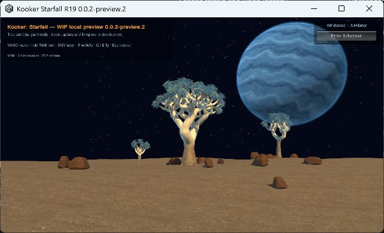

# Starfall 0.0.2-preview.2 — display button

This separate R19 Windows player adds a visible fullscreen/windowed button, current-mode label, remembered window size and optional Alt+Enter shortcut. The display transition does not reload the scene. The existing R06 and 0.0.2-preview.1 runtime files remain unchanged.

Build: `KookerStarfallR19-0.0.2-preview.2-20260912-183552`.
Exact build source: `97975d121ca97e965be1144c1fb5f42efe68a018`.
ZIP: `Builds/Download/KookerStarfallR19-0.0.2-preview.2-20260912-183552-Windows.zip`, 307,964,430 bytes.
SHA256: `e6e63fc0e225cc0d3db10ce5a5247dfe68b20e1f9cab659706342a6b05943c4c`.

| Claim | Status | Evidence | Remaining gap |
|---|---|---|---|
| Visible button enters fullscreen and returns to a window | Verified in native player | [Transition records](../evidence/milestones/display-toggle/native/verified-button-transitions.jsonl); actual frames observed | Other displays/devices untested |
| Original usable window size is restored | Verified: 1280×720 → 2880×1800 → 1280×720 | Same transition records | Restoration following manual resizing unverified |
| Gameplay remains intact across the two transitions | Verified at stationary player | Scene handle, player position/rotation, walk mode and travel distance unchanged; frame count advances | Simultaneous movement during switching untested |
| Build and existing player movement/rendering checks | Passed | [Build record](../evidence/milestones/kokerboom/round-21/preview-build.json); 2,841 IslandValidation assertions; [player evidence](../evidence/milestones/display-toggle/player-smoke/) contains 146 checks and three actual URP captures, zero runtime errors | Automatic checks do not establish native input or sustained FPS |
| Archive and safeguards | Passed locally | 187 archive entries; per-entry hashes; Gitleaks 8.30.1 distribution/current-source/history checks | Hosted checks recorded separately |
| Earlier R06/R19 runtime files preserved | Verified | All 368 recorded runtime files rehashed unchanged after native testing | Historical broader save/build acceptance unchanged |
| Resizable window and Alt+Enter | Implemented; native acceptance unverified | Source and successful build | Resize automation did not complete reliably; user stopped Computer Use with Escape during optional shortcut attempt |

The fullscreen native observation contained desktop overlay UI and is retained locally, not published. No further desktop input followed the user's Escape stop. The last process observation showed the new player responsive and left running in a window.

The controller remains the small first-person R19 inspection stage. Character assets are [shortlisted](CHARACTER-SHORTLIST.md), and the [physical sandbox direction](PHYSICAL-SANDBOX-NEXT.md) is recorded, but neither character integration nor the broader living world is implemented by this display release.
