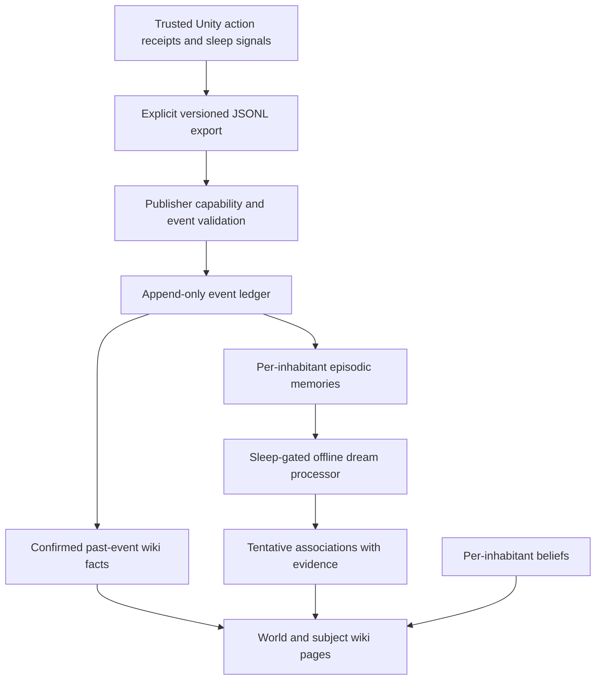
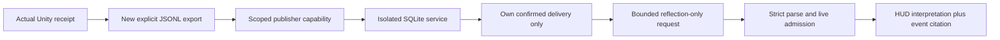

# Native Starfall memory — first local slice

See the [system architecture and installation-state map](SYSTEM-ARCHITECTURE.md) for how Unity, optional inference, inhabitant brains and this service fit together, including the current connections and planned launcher.

Starfall has its own memory service and versioned contracts. It does not import Reflection or Archive Keeper code, personal archives, credentials, configuration or data volumes. Their broad ideas—event evidence, append-only history and separate instance storage—are reference points only. The implementation belongs to this Starfall repository.



The memory process has no game command client or permission mutation API. Confirmed facts and tentative ideas occupy different record types and wiki sections. Nothing in a dream is promoted to a confirmed fact automatically. The authoritative Unity action checks continue to own perception, reach, permission, inventory, navigation and physical effects.

## Implementation and trust boundary

[`StarfallMemoryExport`](../Assets/CityLife/Scripts/StarfallMemoryExport.cs) is an explicit adapter, with no automatic scene attachment or networking. It exports successful nonduplicate action receipts, stable inhabitant identity and trusted sleep transitions into a new JSONL file, flushing each record. It refuses to overwrite an existing export. The current player has not been wired to it; the integration proof uses an isolated Unity editor fixture and the existing `NpcActionApi` to perform a real pickup and delivery.

[`core.py`](../services/starfall-memory/core.py) owns one SQLite database for one configured world/publisher. It validates event provenance, source sequence, ticks, identity, cargo, ownership, occupied destinations and sleep state before atomically appending an event and its derived episode/facts. Exact retries are idempotent; conflicting retries and invalid histories fail closed. The ledger is content-addressed and hash-chained, with SQL UPDATE/DELETE triggers and startup integrity checks.

“Verified” means authenticated trusted-publisher provenance plus the service's contract/invariant checks. The service does not rerun Unity physics and cannot prove a compromised authorized publisher truthful. The database owner can defeat local triggers or replace the entire database; external signed checkpoints/backups are future hardening. Event schema v1 deliberately has no world reset, item transfer, depot-emptying or historical correction operation. New lifecycle operations need explicit schemas and validation.

[`server.py`](../services/starfall-memory/server.py) exposes the local API. The publisher capability can append events; each inhabitant has a different capability for its own identity, episodes, beliefs and dreams. Shared wiki facts describe public past events in the configured world. Another inhabitant's private episodes, beliefs and dream theories are not shared. Request bodies and query strings cannot switch identity or world. No browser origins or cookies are accepted.

The dream processor is `starfall.dream.rules.v1`: deterministic, offline summaries and cautious associations over at most 32 of that inhabitant's events at the sleep boundary. A verified sleep-start opens the window, a wake closes it, and the same sleep returns the same stored dream. This first slice uses an explicit API trigger; automatic gameplay scheduling and optional model-generated prose are future work. Beliefs may be wrong even when their evidence is real. Text is stored as content and has no executable interpretation.

See the complete [API, evidence, record and migration contracts](../services/starfall-memory/contracts/API-v1.md) and [event JSON Schema](../services/starfall-memory/contracts/event-v1.schema.json).

## Local operation

Python 3.12.14 was used for the proof. The service and client use only the standard library. Run these commands from `services/starfall-memory`, supplying the explicit world, source build ID and stable inhabitants you intend to admit:

```powershell
python local.py init --directory .local-memory --world-id YOUR_WORLD_ID --build-id YOUR_APPROVED_BUILD_ID --inhabitant inhabitant-01 --inhabitant inhabitant-02
python server.py --config .local-memory/config.json --data-dir .local-memory/data
```

Initialization creates distinct random capabilities in the ignored local directory and prints only the configuration path. On Windows it restricts the new directory to the current user and SYSTEM; on POSIX it uses private directory/file permissions. It refuses to replace an existing configuration. These capabilities belong only to Starfall. Do not reuse credentials from another service.

The complete configuration is for the service and trusted operator CLI. A future inhabitant client receives only its own capability, never the publisher capability or the complete configuration file.

In a separate terminal, publish an explicit trusted Unity export, inspect the inhabitant's wiki, or request a dream during a verified sleep:

```powershell
python local.py publish --config .local-memory/config.json --events PATH_TO_UNITY_EXPORT.jsonl
python local.py read --config .local-memory/config.json --inhabitant inhabitant-01 --resource wiki
python local.py dream --config .local-memory/config.json --inhabitant inhabitant-01
```

The client only connects to `127.0.0.1`; `--port` changes the local port. Publishing validates the entire file's schemas before sending its events in order. Each accepted event is its own atomic transaction: a later failure leaves earlier accepted events intact, and replay safely resumes via idempotent receipts. It does not read directories of archives or discover personal runtime paths. The export adapter is an explicit file bridge, not a background player hook. Handling disk-full failures and retry/backpressure without stalling gameplay is required before a live game outbox integration.

## Container and storage boundary

The separate [Compose definition](../services/starfall-memory/compose.yaml) names only a Starfall data volume and Starfall configuration secret. Its build context admits only the two service source files and Dockerfile. It publishes `127.0.0.1:17864`, uses an internal network, non-root UID 10001, read-only root filesystem, dropped capabilities and memory/process/CPU limits. There are no external volumes, host archive mounts, personal home directories, Reflection environment files or shared service credentials.

The container recipe is supplied for the local Starfall stack; no container was started or deployed by this task. The HTTP proof instead started a separate short-lived Python process against its own new database, with a filtered environment and a test guard denying outbound socket connections and DNS. The process was stopped after the proof and its temporary capability file removed. Container execution, volume ownership and Windows Docker secret permissions still need actual container acceptance before deployment. The Python base image currently uses the `3.13-slim` tag; pin an inspected image digest before distribution. Initial image acquisition/build is separate from offline runtime operation.

## Reproduce the checks

From the repository root, in a clean source checkout with no existing Unity editor:

```powershell
./tools/verify-memory-unity.ps1
```

That starts only the isolated editor fixture, never the running game. It runs the 2841 foundation assertions, the existing 26 NPC checks and the new 12 export checks. It emits a unique local evidence directory. Then:

```powershell
python -m unittest discover -s services/starfall-memory -p test_memory.py -v
python services/starfall-memory/prove_local.py --unity-export PATH_TO_NEW_UNITY_EXPORT_DIRECTORY --output evidence/local/memory/http-proof-NEW
docker compose -f services/starfall-memory/compose.yaml config --quiet
```

The integration harness checks actual loopback ingestion, exact event hashes, idempotency, rejection boundaries, per-inhabitant memory, shared facts/private theories, sleep gating, immutable history and process restart persistence. Every invocation requires a new evidence directory. Reviewed synthetic evidence is retained separately from private database/configuration/raw logs. [Reviewed results](../evidence/milestones/starfall-memory/local-slice-v1/README.md) record the tested source and remaining gaps.


## Knowledge progression and persistent death/return: design contract

The user-directed [knowledge progression rules](STARFALL-KNOWLEDGE-PROGRESSION.md) define naive starting knowledge, provenance/confidence/corrections, persistent-world death and return, recoverable inventory, at-most-one grounded lesson, privacy, and staged ecology/survival milestones. These are planned, not runtime-proven. Death lessons and post-return reflection remain after the current one-living-thought proof. Existing memory event schema v1 and old saves are unchanged.


## Isolated living-memory candidate: source prepared, runtime pending

[One living-memory thought](LIVING-MEMORY-THOUGHT.md) describes the separate 0.0.6-memory-preview.1 adapter and runner. Real player action receipts are the only event input; the reviewed scoped HTTP/SQLite interface is unchanged. A new reflection-only protocol cannot express actions and retains the 1500 ms deadline. This candidate has not yet passed actual-player acceptance and does not replace existing releases.


