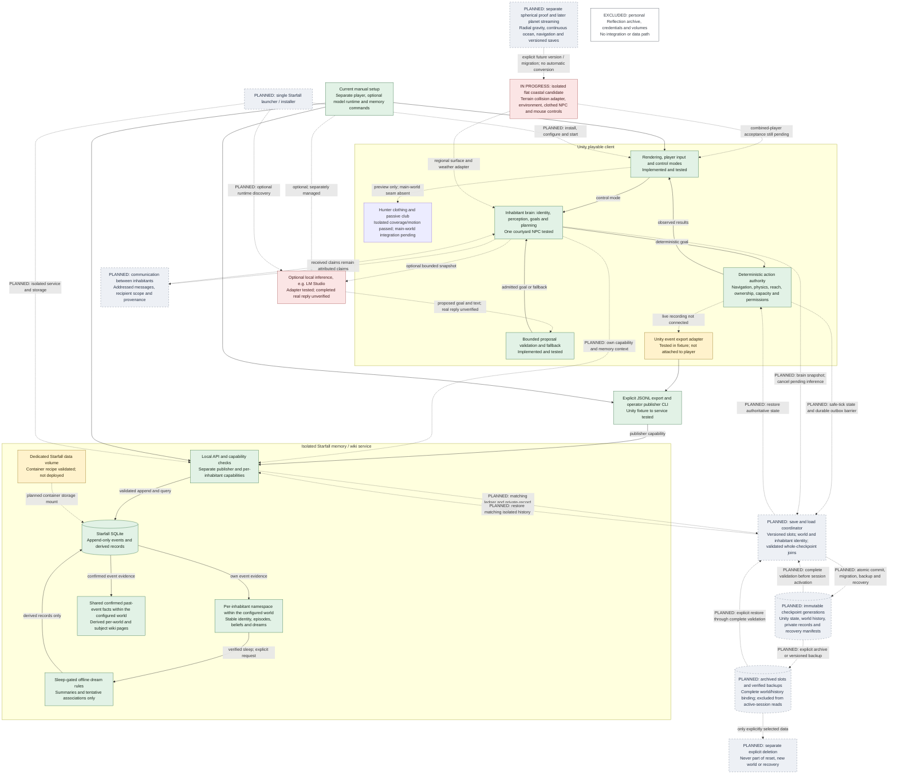

# Starfall system architecture and installation state

Integration workstream update, 13 September 2026: [the separate current-component candidate](INTEGRATED-CANDIDATE.md) assembles coastal terrain, the environment adapter, an autonomous inhabitant and accepted clothing. The compiled round-104 player passed 16 automated runtime checks and native menu clicks; keyboard, full native control and coverage acceptance remain pending. [Planet migration](PLANET-MIGRATION.md) is a staged future gate; the immediate region stays flat and finite. The historical component installation evidence below does not promote this new executable to accepted.

This is the repository-owned map of the Starfall system. Reviewed **13 September 2026** against memory source `0445e0f`, the preserved hybrid preview.2 evidence, and the recorded local Windows player. It is an implementation/installation snapshot, not a live service-health monitor. Cloning this repository does not install its ignored player builds, model runtime, private configuration or database.

The playable client and its deterministic action authority remain the center of the world. Optional inference can suggest bounded goals and text. Starfall memory records verified events and derives memories/wiki/dreams. Neither model output nor a memory record can directly change world state or grant a permission.

The current client evidence covers separate preview/courtyard studies. The [wider world and living sea](STARFALL-LIVING-SEA.md) remain separate work.

The next architectural gate is [versioned save slots and new-game identity](SAVE-GAME-CONTRACT.md), requirement revision `starfall.save.requirements.v1`. It is recorded only: the sole implementation priority remains proving one genuine local-model thought. The planned save coordinator below is not installed or live-wired.

## Component diagram

Solid arrows are implemented paths, including paths exercised only in isolated fixtures. Dotted arrows are optional, planned or not connected to the player; their labels specify which. A tested component does not imply every connection around it is live. Green denotes implemented/tested, amber an implemented adapter not attached to the player, grey planned work, and red an unverified external result.

The database stores both authoritative event evidence and separately typed derived records; the diagram's private memory and wiki nodes are logical views, not additional databases. The direct Python proof used its own new database directory. The named container volume is a supplied configuration, not a running installation.

## Installation-state table

**Implemented and tested** means evidence exists for the stated scope. **Implemented, not live-wired** means code or configuration exists but the current playable client does not use that connection. **Planned** means the component/integration remains future work. **Unverified** means the required outcome has not been established. “Available” below does not mean currently running.

| Component / claim | Status | Installation or wiring state | Evidence | Remaining gap |
|---|---|---|---|---|
| Hunter clothing; club reopened | Original isolated clothing coverage/motion passed; club grip subsequently rejected | Integrated candidate retains garments and excludes the club. The earlier courtyard evidence does not override the later grip/orientation rejection. | [Component and evidence](HUNTER-CLOTHING.md), [candidate exclusions](INTEGRATED-CANDIDATE.md) | Corrected club requires a clean handoff and new visual acceptance; integrated clothing/native controls still need scoped review. |
| Unity playable client and controls | Implemented and tested | Separate local Windows builds; recorded hybrid preview.2 executable exists in the build checkout. Player is launched manually. | [Hybrid build/release record](../evidence/verified/hybrid-diagnostic-release.json), [66-check actual-player run](../evidence/milestones/hybrid-npc/manual-real-30s-20260913/npc-runtime.json) | Physical input, sustained performance and other devices remain separate acceptance; builds are not installed by a repository clone. |
| Deterministic NPC/action authority | Implemented and tested | Runs inside Unity. Current action API owns pickup/delivery mutations and rechecks live permission, reach, sight, ownership and capacity. | [Action boundary](../Assets/CityLife/Scripts/NpcActionApi.cs), [26 action/perception checks](../evidence/milestones/starfall-memory/local-slice-v1/npc-validation.json) | More world actions require explicit authority contracts and checks. |
| Per-inhabitant brain | Implemented and tested for one courtyard NPC | Unity autonomy/planner components hold the current NPC's observations, goals and context. | [NPC autonomy](../Assets/CityLife/Scripts/NpcAutonomy.cs), [optional planner](../Assets/CityLife/Scripts/NpcOptionalPlanner.cs), [hybrid audit](HYBRID-NPC-AUDIT.md) | Multiple independent live NPC brains and lifecycle/identity assignment are planned. Two memory fixture identities do not establish that runtime. |
| Optional local LLM adapter | Implemented and tested for bounded/fake/offline behavior | Optional Unity adapter; disabled by default. Endpoint/model are explicit and operator-managed. Normal deadline is 1500 ms. | [Provider/planner setup and limits](HYBRID-NPC.md), [48 focused diagnostic checks](../evidence/verified/hybrid-diagnostic-validation.json) | Successful real model proposal/dialogue/reflection remains unverified. No model is bundled or automatically loaded. |
| LM Studio / real local inference | Unverified for a completed reply | Separate external runtime, not installed or managed by Starfall. Current running/model state is not polled by this document. | [Manual 30-second probe](../evidence/milestones/hybrid-npc/manual-real-30s-20260913/real-local-probe.json): inventory returned; one completion attempt timed out at 30003 ms; fallback delivered. | A completed reply must pass schema/live validation; reachability is not completed inference. |
| Unity event export and memory bridge | Implemented, not live-wired | Explicit export adapter and publisher CLI passed the isolated Unity-to-service proof. No background hook is attached to the running player. | [Exporter](../Assets/CityLife/Scripts/StarfallMemoryExport.cs), [12 Unity export checks](../evidence/milestones/starfall-memory/local-slice-v1/unity-memory-validation.json), [50 integration checks](../evidence/milestones/starfall-memory/local-slice-v1/integration-report.json) | Durable live outbox, replay/backpressure and disk-full handling before gameplay integration. |
| Isolated Starfall memory/wiki service | Implemented and tested | Standard-library Python API, explicitly started with its own configuration/data directory. Proof processes were stopped afterward. | [Service guide](STARFALL-MEMORY.md), [27 service tests](../evidence/milestones/starfall-memory/local-slice-v1/service-validation.json), [restart/API/CLI proof](../evidence/milestones/starfall-memory/local-slice-v1/integration-report.json) | Persistent service installation, operational supervision and live player connection. |
| Memory database and dedicated volume | SQLite implemented/tested; container runtime unverified | One Starfall world/publisher per SQLite database; append-only event ledger and derived records. Compose declares `starfall_memory_v1` mounted at `/data`. | [Ledger checkpoint](../evidence/milestones/starfall-memory/local-slice-v1/ledger-checkpoint.json), [Compose recipe](../services/starfall-memory/compose.yaml), [configuration validation](../evidence/milestones/starfall-memory/local-slice-v1/container-config-validation.json) | Image build/startup, volume ownership, Docker secret permissions, image digest pinning, backup and scale acceptance. No container deployment is claimed. |
| Per-inhabitant identity, private memory and capabilities | Implemented and tested in service; not live-wired to brains | Each inhabitant capability selects its own episodes, beliefs and dreams. A distinct publisher capability admits Unity events. | [Identity/capability contracts](../services/starfall-memory/contracts/API-v1.md), [cross-namespace tests](../evidence/milestones/starfall-memory/local-slice-v1/service-validation.json) | Secure delivery of only the individual capability and bounded memory context to each live brain. |
| Shared confirmed facts and wiki | Implemented and tested | Shared world/subject pages derive confirmed past-event facts. Private beliefs and dream theories remain separate sections. | [Actual derived wiki](../evidence/milestones/starfall-memory/local-slice-v1/wiki.json) | In-game browsing/recall, larger-world lifecycle and explicit future correction schemas. |
| Sleep-time dreaming | Implemented and tested; gameplay trigger not live-wired | Explicit API request while a verified sleep window is open; offline rules summarize at most 32 own events and append tentative ideas. | [Stored dream](../evidence/milestones/starfall-memory/local-slice-v1/dream.json), [sleep/restart proof](../evidence/milestones/starfall-memory/local-slice-v1/integration-report.json) | Real gameplay sleep controller/scheduler and optional model-generated prose. This is not learning. |
| Communication between inhabitants | Planned | No message router, conversation protocol, sharing capability or delivery loop is implemented. | [Current API route inventory](../services/starfall-memory/contracts/API-v1.md) has no messaging route. | Addressing, sender/recipient identity, allowed disclosure, delivery evidence, recipient memory and conversation tests. |
| Current manual setup | Implemented and tested within documented scope | Launch a versioned player; optionally configure/opt into inference; initialize and start memory separately; explicitly publish/read/dream through the local CLI. | [Player/provider setup](HYBRID-NPC.md), [memory setup](STARFALL-MEMORY.md), [CLI integration checks](../evidence/milestones/starfall-memory/local-slice-v1/integration-report.json) | These steps are not a unified installer or a live game-memory connection. |
| Single Starfall launcher/installer | Planned | No integrated launcher, installation bundle or automatic service management exists. | Current [player build tools](../tools/build-npc.ps1) and [memory CLI](../services/starfall-memory/local.py) are separate tools. | Unified install/update/start/stop, compatible versions, isolation, health checks, rollback and end-to-end user acceptance. |
| Versioned save slots and new-game lifecycle | Planned; requirements recorded | No complete-game save coordinator or player save/load flow exists. Existing edit persistence and memory transactions are separate boundaries. | [Save/new-game contract v1](SAVE-GAME-CONTRACT.md), [existing edit boundary](WORLD-FOUNDATION.md) | Unique world/seed per new game, stable world-scoped inhabitants, complete atomic checkpoints, validated load/migration, backup/recovery, isolation fixtures and actual save/quit/relaunch/load acceptance. Deferred behind the living-thought priority. |
| Archive, backup and explicit deletion boundary | Planned; requirements recorded | Archived worlds retain their complete state/history and are excluded from active-session queries. Reset creates a fresh slot; archive and destructive deletion are separate choices. | [Archive/restore and recovery contract](SAVE-GAME-CONTRACT.md) | Versioned verified backups, explicit archive/restore UI, corruption recovery and proof that no other slot or personal archive is modified. |
| Integrated coastal candidate | Source integration in progress; runtime unverified | Separate regional build and adapters. Existing component evidence remains scoped to original executables. | [Dependencies and same-executable gates](INTEGRATED-CANDIDATE.md) | Compile, native traversal/mouse/menu/display, autonomous actions, environment/shelter and clothing coverage in one player. |
| Round planet and island/boat progression | Planned | Immediate terrain remains flat/streamable and finite. No spherical runtime, boat travel or coordinate/save migration exists. | [Staged migration and smallest spherical proof](PLANET-MIGRATION.md) | Curvature/gravity/camera/ocean/navigation/save proof, streaming/resource persistence and later boat travel. |

## Authority, identity and privacy boundaries

- **Unity owns world truth and actions.** Inference sees bounded snapshots and can return proposals only. Deterministic checks admit or reject them. Memory/dream text has no world mutation or permission authority.
- **A brain is an inhabitant's logical identity and decision context.** It does not require a dedicated LLM process/model for each NPC. A future shared inference engine must still keep contexts and capabilities separate; that multi-inhabitant runtime is not implemented here.
- **A saved world is a unique instance, not a seed or template name.** The planned lifecycle assigns a new world and slot for each new game and stable `(world_id, inhabitant_id)` identities within it. New character preserves the existing world. Reset defaults to a fresh slot, preserving the old one. Save/load must bind authoritative Unity state and the exact memory/history boundary; incompatible partial joins fail before activation. See [checkpoint, migration and recovery requirements](SAVE-GAME-CONTRACT.md).
- **The publisher is trusted Unity/operator code.** The memory service authenticates it and validates event/history invariants; it does not rerun physics or prove a compromised engine truthful. The service/operator configuration contains publisher and inhabitant capabilities. Individual brains must receive only their own capability, never that whole file.
- **Private memory stays private by namespace.** Shared confirmed facts describe past events in the world. Beliefs/theories remain attributed and uncertain, even when they cite real evidence. Future communication must explicitly deliver an allowed message; it must not grant general access to another inhabitant's memory or silently promote a received claim to world truth.
- **Personal Reflection is outside this system.** No personal Reflection archive, credentials, environment files or volumes are imported, discovered, mounted or shared. Starfall uses its own schema, configuration, keys and storage. Reflection/Archive Keeper are inspiration only, not runtime dependencies or migration targets.
- **Local operator/host trust still matters.** Per-inhabitant API capabilities and SQL append-only triggers are not protection against a host administrator who reads the service configuration or rewrites the database. No stronger process/account isolation claim is implied.

## Current setup and eventual single entry point

Today the user chooses a preserved player build and starts it manually. Optional local inference is separately configured and opted into. The memory service has its own explicit initialization/start commands and data directory; the tested bridge publishes a selected Unity fixture export. Starting both components does not connect them automatically. Follow [hybrid setup](HYBRID-NPC.md) and [memory setup](STARFALL-MEMORY.md) for the exact current commands. The Unity editor is a development/build dependency, not something a future player installer should require.

The desired launcher/installer should become one Starfall entry point that:

1. Installs a compatible versioned player and memory service, validates prerequisites, and creates only Starfall-owned configuration/storage.
2. Keeps inference optional, discovers a deliberately selected local provider, and supports deterministic play without a model. Existing external model installations remain separately owned.
3. Gives the trusted event publisher and each inhabitant the correct separate capability, then starts and health-checks the components actually required for that session.
4. Connects a tested durable player outbox, bounded memory retrieval and verified gameplay sleep scheduling; reports whether each integration is ready, unavailable or using fallback.
5. Provides start/stop, inspectable evidence, versioned save slots and distinct new-world/new-character operations, explicit schema migration, export/import, backup, update and rollback without replacing older worlds or connecting personal archives. Loading validates a complete world/history checkpoint, and derived wiki rebuilds retain immutable evidence.
6. Passes installation-to-play acceptance in the actual interface, including service failure/offline recovery. A successful installer process or health endpoint alone will not establish that result.

This is the target design, not an implemented launcher specification or authorization to deploy it.

## Keeping this map current

Update this diagram and installation-state table in the same change that adds/removes a component, connects a live boundary, changes capability/storage scope, or changes installation behavior. Link the exact retained source, test, runtime or release evidence that justifies each status; identify which build/context was tested. Record unverified gaps instead of promoting a component because code, a configuration file or a package exists. Preserve older evidence snapshots. Recheck runtime availability when reporting a live state; this document does not run a monitor or scheduled task.

Supporting detail: [world foundation](WORLD-FOUNDATION.md), [save/new-game architectural gate](SAVE-GAME-CONTRACT.md), [hybrid NPC](HYBRID-NPC.md), [latest local-model diagnostic](HYBRID-DIAGNOSTIC-30S.md), [native memory](STARFALL-MEMORY.md), [reviewed memory evidence](../evidence/milestones/starfall-memory/local-slice-v1/README.md).

## 13 September: request-local reasoning-off diagnostic failed

Separate source d11f5b2 built successfully with 51 hybrid checks. One actual-player request used reasoning_effort none and produced zero reasoning tokens. Prompt processing consumed about 24 seconds; incomplete JSON remained at the 30001 ms cancellation. The actual player correctly failed the genuine-thought gate: 65 checks passed, one failed, zero runtime errors; deterministic fallback delivered one item. Shared model inventory remained unchanged. Reviewed local report and inspected timeout screenshot: evidence/local/thought-reasoning-off-20260913/REPORT.md and runtime/40-real-local-proposal-outcome.png. No genuine thought or new visual acceptance is claimed. Existing artifacts and component authority boundaries are preserved.

## 13 September: smaller-model endpoint pass, player launch blocked

Isolated source 45cac4a requires nonempty dialogue/reflection in both provider schema and strict parser. The separate player built with zero errors/warnings and 54 hybrid checks. LM Studio installed google/gemma-4-e4b Q4_K_M locally (6326843776 bytes including projector), preserving the existing loaded 26B model. At the user's direction, the endpoint probe used the already-loaded MLX E4B on Irwins-Mac-mini-2.local through laptop loopback: the corrected strict response completed in 3046 ms with zero reasoning tokens. This is linked-Mac compute, not laptop-only inference. Automatic approval review blocked the compiled-player launch with the sole reason blocked by policy; no new player thought or screenshot acceptance is claimed. Exact report, hashes, endpoint responses and prepared manual launcher: evidence/local/thought-e4b-20260913/REPORT.md. Component action authority and earlier artifacts remain unchanged.

Future design only: [knowledge progression, persistent death/return and resource transformation](WORLD-KNOWLEDGE-PROGRESSION.md) defines provenance, private-memory boundaries, inventory recovery and save/reload acceptance. These mechanics are not implemented by the current integrated preview.
