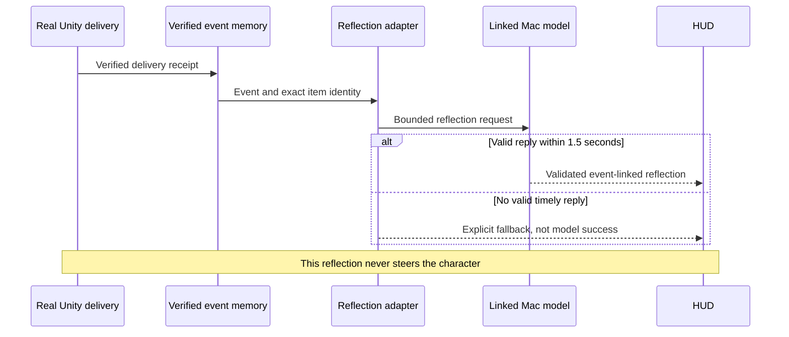

# Starfall: today's status and NPC component map

Status: 15 September 2026. Retained playable fallback is round211; newer failed candidate binaries were removed, with source and evidence preserved. This is not final release acceptance.

## What was demonstrated

| Component | Evidence-backed status | Remaining gap |
|---|---|---|
| Ordinary local-model survival | Retained211 runs30/31: exploration, seven meals and two drinks before restart; new drink transaction19 after restart | Local roaming, not entire canyon exploration; no natural death observed |
| Scoped save and restart | Preserved snapshot417 restored needs/knowledge; new validated model action and transaction followed | Not complete world-object saving; second test exceeded its five-minute plan by25.782seconds |
| Grounded death lesson | Same211 run22 accelerated dehydration/starvation diagnostic preserved world/identity, returned to refuge and supplied verified cause to a later executed model decision | Not naturally elapsed death or proof that the lesson improved policy |
| Spring repair | Terrain-fit mesh work and Editor diagnostics underway | User's raised-sheet rendering complaint remains unaccepted; interaction and saved-state compatibility must be checked |
| Giant/camera | Newer candidate footage shows huge distant giant; labelled observer cutaway returns to actor follow | Normal activity-area view remains slope-dominated; reference quality unaccepted |
| Immediate event reflection | Earlier success exists; recent broad regressions repeatedly timed out at unchanged1.5seconds | Reliable completion and Mac-side correlated telemetry unresolved |
| Build lifecycle | Automatic successful and runtime-failed candidate cleanup verified | Cleanup is not release promotion;211 is the sole retained player |

## Components

- Unity world: terrain, water, weather, colliders, refuge, plants and resource identity. Authoritative physical state.
- Inhabitant body/food model: energy, hydration, inventory, resource consumption, growth and scoped knowledge.
- Perception and action eligibility: offers only presently allowed actions; unseen world facts are not granted by the model.
- Survival decision adapter: sends bounded needs, eligible actions and validated own-scope context to LM Studio; current survival route uses Windows local Gemma, with a five-second deadline.
- Admission validator: checks model identity, complete valid answer, allowed action and current context before execution. Invalid/late replies do not become actions.
- Deterministic executor: navigation, interaction and actual state changes; records outcomes rather than trusting the model's narration.
- Memory/storage: private local service and scoped food snapshots/event evidence; restart restores recorded state. Full-world save is unfinished.
- Immediate reflection adapter: separate post-event request, currently linked Mac Gemma,1.5-second deadline. Its two-word delivery reflection does not control movement.
- HUD/evidence: displays admitted choices, actual outcomes, provenance and fallback; recordings are labelled by build and camera mode.
- Wiki/derived memory: reviewed architecture/foundation, not established here as a complete live in-game wiki integration.

## Sequence: model choice becomes a real action

```mermaid
sequenceDiagram
    participant W as Unity world and body
    participant P as Perception and eligible actions
    participant A as Survival adapter
    participant L as LM Studio local model
    participant V as Admission validator
    participant E as Navigation and interactions
    participant S as Scoped storage and HUD
    W->>P: Observations, needs and known facts
    P->>A: Allowed actions and validated context
    A->>L: Bounded decision request
    Note over W,L: World continues; survival deadline is 5 seconds
    L-->>V: Complete proposed action
    alt Valid, timely and still allowed
        V->>E: Admit action
        E->>W: Move or interact
        W-->>S: Actual result and state change
        S-->>P: Grounded context for later decisions
    else Late, invalid or stale
        V-->>S: Record rejection or safe fallback
        Note over V,W: No fabricated model action
    end
    S->>S: Persist scoped state
    Note over W,S: Restart reloads saved state, not a new world
```

## Separate post-event reflection



Today's install remains a Unity executable plus manually launched private memory service and already-loaded LM Studio instances. Do not present this as a finished Docker-based one-click installation. Full same-build acceptance, ordinary-view quality, protected review, ZIP and narrated final walkthrough remain open.
