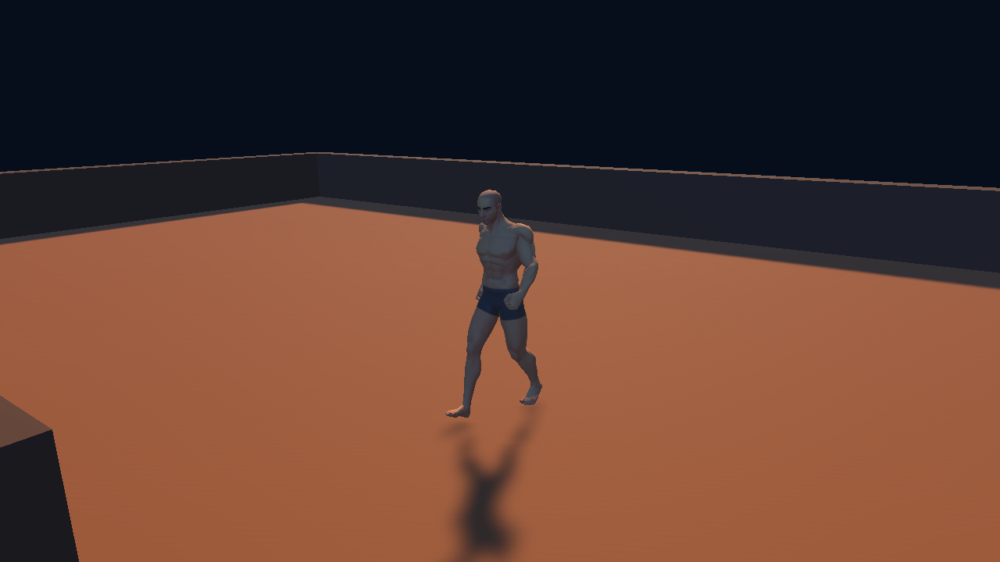

# Visual milestone catalogue

The [interactive Kokerboom visual review](KOKERBOOM-VISUAL-REVIEW.html) provides an image-and-score view of the preserved tree rounds. Exact scope and acceptance rules remain in [the critique record](KOKERBOOM-CRITIQUE.md).

Captures are retained in order. Source references, Unity Windows-player captures, and Unity editor offscreen renders are labelled separately. No concept art is used as implementation evidence. Camera changes and limitations are described per stage.

## 00 — Browser source reference · 2026-09-09

Actual local browser build of CityLife 0.53.1 at `b713070`, seed 4242, opened through its documented development mode. This captures the source sand/sea/neon palette and source interface. It is a newly initialized local source world, not authenticated production/player-save evidence. The Unity milestone is permitted to start with a fresh larger island; the old road and plot layout is intentionally deferred.

## 01 — Failed first player capture · 2026-09-09 19:56 UTC

[Retained black capture](../evidence/milestones/01-failed-black-player-2026-09-09.png)

The first Windows build compiled and passed deterministic checks, but its background route produced uniform black frames. Opening the actual native player exposed a URP initialization failure: the unused template SSAO feature remained in the renderer list while disabled, and its required resources were stripped. This is **failed visual evidence**, not a delivered milestone. The correction removes the unused feature from the renderer and hardens image evidence checks. Real visible-player verification follows.

## 02 — First visible Unity island · 2026-09-09

Actual Build 03 Windows player, seed 4242, viewed from Island vista after the Night button. The native window image was captured before desktop control was paused and preserved from the existing image in memory at 20:09 UTC; preserving it required no new desktop capture or input. The GUI event is timestamped 20:04:15 UTC in the runtime log. The island, water and interface are visible, confirming the black-player defect was corrected in this build. This is a window capture at desktop scale, not the full-resolution game framebuffer.

The finite ocean plane's far corner is visible at the top, and interface readability needs review at normal player size. These are remaining visual gaps. Native keyboard movement and screenshot shortcuts remain unverified. The user reported that the island looks good and resembles the earlier world; this is user feedback, separate from the captured evidence. No roads, plots or buildings are claimed by this image.

### 02b — User-requested framed snapshot · 2026-09-09 20:09 UTC

The coordinating task's Discord helper captured this actual open player under a separate, explicitly renewed capture-and-post instruction. It includes the CityLife Island title bar and control strip. The coordinator independently inspected the file before sending it to this catalogue. It shows the same Build 03 stage and shares the finite-ocean-edge, desktop-scale readability and native-input gaps above. The artifact's recorded write time is 20:09:52 UTC. Posting status is recorded separately from image creation.

The user subsequently reported manually posting this framed image in the CityLife Unity Discord channel. That posting is user-reported, not independently verified here. No duplicate post is made by this implementation task.

## 03 — Offscreen candidate route · 2026-09-09 20:19 UTC

The candidate built at 20:18:30 UTC renders the same versioned island through URP's single-camera render request into a 1600×900 GPU texture. The overview was saved at approximately 20:19:01 UTC. The former finite ocean corner is absent. This is actual application scene output, not concept art or desktop capture. It intentionally excludes the HUD and does not establish native window presentation. Distant water still shows fine aliasing and the overview uses coarse terrain LOD.

Flight phase, approximately 20:19:09 UTC, after 297.95m of scripted movement over the neighbourhood reserve. This shows coastline and relief at a closer scale. It does not imply plots, construction permissions or buildings.

Walking phase, approximately 20:19:17 UTC, after 48.66m of scripted travel at eye height. Recorded ground penetration was zero. These views do not establish the appearance of vegetation, native mouse look, WASD responsiveness or object collisions. All three images were inspected. [The exact route report](../evidence/verified/offscreen-route.json) retains timings, poses, render coverage, image checks and acceptance limits.

The walking image is retained as the **before** baseline for the next close-up detail iteration. Its flat olive surface is terrain colour; no visible grass blades, tufts, rocks or trees are claimed from that image.

## 04 — Arid ground detail, before and after · 2026-09-09 20:29–20:35 UTC

The same landing/walking route now shows visible straw-coloured tufts, dry-ground texture and the original-style cyan/magenta plants. Compare with **03 walking** above. The texture is Poly Haven's CC0 Dry Mud Field 001; grass, rocks, quiver forms and neon plants are procedural geometry in this repository. The Kenney models in the asset catalogue were not imported into this scene.

Earlier transient instance submissions counted plants without rendering them in the offscreen route. Persistent chunk-owned vegetation meshes corrected that defect. Counters remain estimates of enabled geometry, not proof of pixel visibility. The 20:29 images were inspected: [overview](../evidence/milestones/04a-arid-overview-2026-09-09.png), [flight](../evidence/milestones/04b-arid-flight-2026-09-09.png), and [route report](../evidence/verified/arid-detail-route.json). Far-water ripple filtering also reduces the earlier moiré.

The 20:35 close-up uses the new **4 / Detail** viewpoint at 1.85m above ground, a few metres from the actual generated tuft nearest Landing. Individual blades, small rocks and surface detail are visible. No scenery was inserted for the screenshot. This is offscreen URP scene output, excluding HUD and native input. The [final candidate report](../evidence/verified/final-candidate-route.json) retains all four images, including repeated overview/flight/walking checks. Earlier milestone files remain unchanged.

The bounded first detail pass is verified in these images. Density, wind, richer ground blending, native presentation and manual traversal remain later acceptance or visual-polish work. The [free-asset catalogue](ASSET-CATALOGUE.md) records what is available, imported and tested. Its optional [enlarged HTML view](ASSET-CATALOGUE.html) uses unchanged asset pixels with CSS framing; opening that local HTML was blocked by the browser URL policy, so browser layout remains unverified.

## Kokerboom follow-up — Round 01 rejected · 2026-09-10

The isolated `codex/kokerboom-cosmic-desert` follow-up begins with the procedural tree, before a landscape rewrite. An independent critic inspected all nine actual Unity 6000.6.0f1 URP offscreen renders of the specimen and populated prototype patch. **Round 01 was rejected: botanical mean 3.75, art mean 4.50, overall 3.75/10 (displayed 3.8).** Thin-branch corrugation and holes, disconnected-looking joins, tiled bark and a sharp basal skirt, sparse crowns, dark rosette sockets, limited demonstrated variation, and black canopies at walking distance require revision.

[Exact six scores, all nine preserved images, and required Round 02 views](KOKERBOOM-CRITIQUE.md#round-01-rejected) are recorded with the [render manifest](../evidence/milestones/kokerboom/round-01/metrics.json). The independent acceptance rule remains both means at least 9.0 and no major defect. Round 02 must repeat the nine views and add isolated rosette top/side views, a juvenile close-up, and within-age seed variation. A populated 3D prototype patch is sufficient for this first tree review; full terrain, water, and underworld work are not prerequisites.

The [first numerical validation](../evidence/verified/kokerboom-round-01-validation.json) passed **325 assertions with independent regeneration** at 17:45:41 UTC. That establishes the recorded Round 01 mesh-data checks and reproducibility, not visual quality or validation of subsequent geometry changes. Native input and presented-frame performance remain unverified. No earlier milestone or Round 01 image was replaced by this catalogue update.

## Kokerboom follow-up — Round 02 not accepted · 2026-09-10

The independent critic inspected all fourteen actual Unity URP renders. **Round 02 was not accepted: botanical mean 5.00, art mean 4.75, overall 4.75/10 (displayed 4.8)**, compared with Round 01's 3.75. Branch ribbing persists without cast shadows, leaving geometry/normals/shader causes unresolved. Embossed-cell bark, juvenile bud/pole form, socket-like rosettes, near-identical adult proportions and dark branch-dominated population views still require revision. No unfinished-ocean or galaxy penalty was applied to this tree-only prototype.

[Exact six scores and all fourteen preserved images](KOKERBOOM-CRITIQUE.md#round-02-not-accepted) accompany the [Round 02 render manifest](../evidence/milestones/kokerboom/round-02/metrics.json). The [numerical report](../evidence/verified/kokerboom-round-02-validation.json) separately passed **349 assertions with independent regeneration**, including wood topology checks, at 18:07:37 UTC. That numeric result does not override the visual rejection or validate subsequent geometry changes. Further procedural repair and actual Unity comparison with the credited Poly Haven candidates are pending review; no replacement is accepted yet.

## Kokerboom follow-up — Round 03 imported candidate comparison · 2026-09-10

This is a **narrow comparison of two imported Poly Haven originals**, not another procedural-family acceptance round. The source model scale is retained through Unity's importer; root translation aligns each model to the small prototype patch. Source texture maps are assigned explicitly. Exact Latin species, procedural seed/age variation, a complete tree family, population suitability, and world integration are not asserted.

The [Round 03 manifest](../evidence/milestones/kokerboom/round-03/metrics.json) records twelve actual Unity 6000.6.0f1 URP GPU renders at `2026-09-10T18:24:00.702303Z`. Technical capture checks passed with **0 errors and 1 warning**. These are offscreen editor captures, not publisher previews or evidence of native input and presentation. The independent critic reviewed all twelve and supplied a [scoped candidate comparison](KOKERBOOM-CRITIQUE.md#round-03-scoped-imported-candidate-review); no overall or full-family score is assigned. The procedural **349-assertion Round 02 result does not apply to these imported meshes**.

PH01 scored joins **8.5**, bark **8.5**, rosettes **7.5**, palette **4.5**, and world readability **6.5**. PH02 joins remain **unverified for its unbranched form**; bark scored **8.5**, rosettes **8.0**, palette **5.0**, and readability **7.0**. The reviewer recommends PH01's natural shoulders/surface, PH02's substantial overlapping inner-upright/outer-drooping leaves, and both candidates' varied bark, scars and peeling. A uniform gold tint is not recommended. These scoped results did not replace **Round 02's full-family overall of 4.75** or establish an accepted replacement. Round 04 below is a separate full-family review.

| ID | Preserved actual Unity image |
|---|---|
| 01 | [PH01 neutral front](../evidence/milestones/kokerboom/round-03/2026-09-10-01-ph01-neutral-front.png) |
| 02 | [PH01 neutral three-quarter](../evidence/milestones/kokerboom/round-03/2026-09-10-02-ph01-neutral-three-quarter.png) |
| 03 | [PH01 branch region](../evidence/milestones/kokerboom/round-03/2026-09-10-03-ph01-branch-region.png) |
| 04 | [PH01 trunk bark](../evidence/milestones/kokerboom/round-03/2026-09-10-04-ph01-trunk-bark.png) |
| 05 | [PH01 foliage](../evidence/milestones/kokerboom/round-03/2026-09-10-05-ph01-foliage.png) |
| 06 | [PH01 cosmic eye-level view](../evidence/milestones/kokerboom/round-03/2026-09-10-06-ph01-cosmic-eye-level.png) |
| 07 | [PH02 neutral front](../evidence/milestones/kokerboom/round-03/2026-09-10-07-ph02-neutral-front.png) |
| 08 | [PH02 neutral three-quarter](../evidence/milestones/kokerboom/round-03/2026-09-10-08-ph02-neutral-three-quarter.png) |
| 09 | [PH02 branch region](../evidence/milestones/kokerboom/round-03/2026-09-10-09-ph02-branch-region.png) |
| 10 | [PH02 trunk bark](../evidence/milestones/kokerboom/round-03/2026-09-10-10-ph02-trunk-bark.png) |
| 11 | [PH02 foliage](../evidence/milestones/kokerboom/round-03/2026-09-10-11-ph02-foliage.png) |
| 12 | [PH02 cosmic eye-level view](../evidence/milestones/kokerboom/round-03/2026-09-10-12-ph02-cosmic-eye-level.png) |

Primary sources are [Poly Haven Quiver Tree 01](https://polyhaven.com/a/quiver_tree_01) and [Quiver Tree 02](https://polyhaven.com/a/quiver_tree_02), covered by the publisher's [CC0 asset licence](https://polyhaven.com/license). The [PH01 per-file provenance](../Assets/CityLife/Art/PolyHaven/QuiverTree01/provenance.json), [PH02 per-file provenance](../Assets/CityLife/Art/PolyHaven/QuiverTree02/provenance.json), and [asset credits](ASSET-CREDITS.md) identify the exact FBX/texture files and creators. Candidate renders are implementation evidence of this comparison only; the earlier procedural render sets and their scores remain preserved separately.

Lighting remains configurable. Discussion of a visible sun versus no visible sun is exploratory, not a fixed final requirement; the blue gas giant remains a planet. Neutral and cosmic comparison presets do not settle that design choice. See the [working reference scope](KOKERBOOM-REFERENCE.md#art-direction-and-reference-provenance).

## Kokerboom follow-up — Round 04 not accepted · 2026-09-10

The revised procedural family has fifteen preserved actual Unity URP captures. The [render manifest](../evidence/milestones/kokerboom/round-04/metrics.json) records `2026-09-10T18:28:46.7582526Z`, technical capture checks passed, **0 errors and 1 warning**. The independent critic found the evidence sufficient and returned **NOT ACCEPTED: botanical mean 6.125, art mean 5.25, overall 5.25/10**. The six scores are **6.5 / 6.0 / 6.0 / 6.0 / 5.5 / 5.0** in the fixed rubric order. Native controls and presented-frame behaviour are not established by these offscreen images.

Preserve the wood repair: bands are largely gone in 04 and 15. Remaining work is a rounded, deeper overlapping canopy, shorter exposed terminal branches, natural leaf cross-sections and juvenile attachment, peeling bark with varied substrate, stockier/asymmetric seed variants, and visible blue-green leaf areas at player framing. White diagnostic 15 is too bright for subtle shading assessment. [The exact independent findings](KOKERBOOM-CRITIQUE.md#round-04-not-accepted) keep imported-candidate scores and numerical checks outside the visual means.

| ID | Preserved actual Unity image |
|---|---|
| 01 | [Neutral front](../evidence/milestones/kokerboom/round-04/2026-09-10-01-neutral-front.png) |
| 02 | [Neutral three-quarter](../evidence/milestones/kokerboom/round-04/2026-09-10-02-neutral-three-quarter.png) |
| 03 | [Neutral rear](../evidence/milestones/kokerboom/round-04/2026-09-10-03-neutral-rear.png) |
| 04 | [Branch-union close-up](../evidence/milestones/kokerboom/round-04/2026-09-10-04-branch-union-closeup.png) |
| 05 | [Trunk-bark close-up](../evidence/milestones/kokerboom/round-04/2026-09-10-05-trunk-bark-closeup.png) |
| 06 | [Terminal-rosette close-up](../evidence/milestones/kokerboom/round-04/2026-09-10-06-terminal-rosette-closeup.png) |
| 07 | [Age lineup with metre scale](../evidence/milestones/kokerboom/round-04/2026-09-10-07-age-lineup-metres.png) |
| 08 | [Cosmic prototype at eye level](../evidence/milestones/kokerboom/round-04/2026-09-10-08-cosmic-gameplay-eye-level.png) |
| 09 | [Cosmic prototype overlook](../evidence/milestones/kokerboom/round-04/2026-09-10-09-cosmic-gameplay-overlook.png) |
| 10 | [Neutral front without shadows](../evidence/milestones/kokerboom/round-04/2026-09-10-10-neutral-front-no-shadows.png) |
| 11 | [Isolated rosette from above](../evidence/milestones/kokerboom/round-04/2026-09-10-11-isolated-rosette-above.png) |
| 12 | [Isolated rosette from the side](../evidence/milestones/kokerboom/round-04/2026-09-10-12-isolated-rosette-side.png) |
| 13 | [Juvenile close-up](../evidence/milestones/kokerboom/round-04/2026-09-10-13-juvenile-closeup.png) |
| 14 | [Adult seed variation](../evidence/milestones/kokerboom/round-04/2026-09-10-14-adult-seed-variation.png) |
| 15 | [Untextured branch-union close-up](../evidence/milestones/kokerboom/round-04/2026-09-10-15-untextured-branch-union-closeup.png) |

The [Round 04 numerical report](../evidence/verified/kokerboom-round-04-validation.json) separately passed **349 assertions with independent regeneration** at 18:25:55 UTC. Its nine recorded wood inspections each have a single connected closed manifold surface. Passing those checks does not score bark, leaf anatomy, silhouette or lighting, and does not validate the imported Poly Haven meshes. [Current critique status and exact report hash](KOKERBOOM-CRITIQUE.md#round-04-not-accepted) remain separate from the preserved Rounds 01–03.

## Kokerboom follow-up — Round 05 shader failure · 2026-09-10

The first PH01 hybrid attempt failed shader compilation (`inversesqrt` undeclared on DX11). The [failure manifest](../evidence/milestones/kokerboom/round-05/metrics.json) preserves three errors, one warning and only one of 21 intended captures. The [front image](../evidence/milestones/kokerboom/round-05/2026-09-10-01-neutral-front.png) is failed-run evidence, with no assigned score. The later successful capture set does not replace this failed attempt.

## Kokerboom follow-up — Round 06 scoped WIP preview · 2026-09-10

The [R06 manifest](../evidence/milestones/kokerboom/round-06/metrics.json) records two actual Unity stage captures at `2026-09-10T18:50:27.6914345Z`, technical checks passed, zero errors and one warning. Independent scoped scores are **palette 4.5/10 and readability 5.0/10**; this is not a six-criterion family review. The [separate new-only WIP build](../evidence/milestones/kokerboom/round-06/preview-build.json) succeeded and was launched as a small local study. It is not a completed larger world. [Current preview/branding boundaries](STARFALL.md) remain separate from image acceptance.

| ID | Preserved actual Unity image |
|---|---|
| 01 | [Preview eye level](../evidence/milestones/kokerboom/round-06/2026-09-10-01-preview-eye-level.png) |
| 02 | [Preview overlook](../evidence/milestones/kokerboom/round-06/2026-09-10-02-preview-overlook.png) |

## Kokerboom follow-up — Round 07 hybrid family not accepted · 2026-09-10

All **21 preserved actual Unity images** were independently reviewed and found sufficient for the fixed six criteria. **R07 was rejected: anatomy 6.0, joins/surface 5.0, rosettes/leaves 7.0, age/size variation 6.0, palette/light 4.5, readability 5.0. Botanical mean 6.00; art mean 4.75; overall 4.75/10.** The [manifest](../evidence/milestones/kokerboom/round-07/metrics.json) records `2026-09-10T19:01:40.8125014Z`, technical capture checks passed, zero errors and one warning.

The independent findings identify a narrow peaked cage, severe horizontal branch texture stretch and mirrored bark, sparse coverage/exposed stubs despite improved curved source leaves, similar mature structures, and a juvenile stump. Separate basal pieces do not supply missing healthy foliage. The albedo/fill diagnostics identify missing geometric coverage, rather than an issue that can be solved by lighting alone. [Exact scores and scope](KOKERBOOM-CRITIQUE.md#round-07-hybrid-family-not-accepted) exclude scoped R03/R06 scores and the obsolete-for-this-hybrid R04 numeric pass.

| ID | Preserved actual Unity image |
|---|---|
| 01 | [Neutral front](../evidence/milestones/kokerboom/round-07/2026-09-10-01-neutral-front.png) |
| 02 | [Neutral three quarter](../evidence/milestones/kokerboom/round-07/2026-09-10-02-neutral-three-quarter.png) |
| 03 | [Neutral rear](../evidence/milestones/kokerboom/round-07/2026-09-10-03-neutral-rear.png) |
| 04 | [Branch union closeup](../evidence/milestones/kokerboom/round-07/2026-09-10-04-branch-union-closeup.png) |
| 05 | [Trunk bark closeup](../evidence/milestones/kokerboom/round-07/2026-09-10-05-trunk-bark-closeup.png) |
| 06 | [Terminal rosette closeup](../evidence/milestones/kokerboom/round-07/2026-09-10-06-terminal-rosette-closeup.png) |
| 07 | [Age lineup metres](../evidence/milestones/kokerboom/round-07/2026-09-10-07-age-lineup-metres.png) |
| 08 | [Cosmic gameplay eye level](../evidence/milestones/kokerboom/round-07/2026-09-10-08-cosmic-gameplay-eye-level.png) |
| 09 | [Cosmic gameplay overlook](../evidence/milestones/kokerboom/round-07/2026-09-10-09-cosmic-gameplay-overlook.png) |
| 10 | [Neutral front no shadows](../evidence/milestones/kokerboom/round-07/2026-09-10-10-neutral-front-no-shadows.png) |
| 11 | [Isolated rosette above](../evidence/milestones/kokerboom/round-07/2026-09-10-11-isolated-rosette-above.png) |
| 12 | [Isolated rosette side](../evidence/milestones/kokerboom/round-07/2026-09-10-12-isolated-rosette-side.png) |
| 13 | [Juvenile closeup](../evidence/milestones/kokerboom/round-07/2026-09-10-13-juvenile-closeup.png) |
| 14 | [Adult seed variation](../evidence/milestones/kokerboom/round-07/2026-09-10-14-adult-seed-variation.png) |
| 15 | [Untextured branch union closeup](../evidence/milestones/kokerboom/round-07/2026-09-10-15-untextured-branch-union-closeup.png) |
| 16 | [Cosmic leaf albedo only](../evidence/milestones/kokerboom/round-07/2026-09-10-16-cosmic-leaf-albedo-only.png) |
| 17 | [Cosmic strong cool fill](../evidence/milestones/kokerboom/round-07/2026-09-10-17-cosmic-strong-cool-fill.png) |
| 18 | [Source rosette with basal front](../evidence/milestones/kokerboom/round-07/2026-09-10-18-source-rosette-with-basal-front.png) |
| 19 | [Source rosette with basal side](../evidence/milestones/kokerboom/round-07/2026-09-10-19-source-rosette-with-basal-side.png) |
| 20 | [Source rosette with basal underside](../evidence/milestones/kokerboom/round-07/2026-09-10-20-source-rosette-with-basal-underside.png) |
| 21 | [Source basal pieces only](../evidence/milestones/kokerboom/round-07/2026-09-10-21-source-basal-pieces-only.png) |

The original PH01 source files remain unchanged; the source-leaf placements, tint and bark mapping are generated derivatives. Basal pieces in 18–21 remain diagnostic-only, outside the hybrid trees. R04's 349 assertions do not apply to the changed architecture/source leaves. Future untextured branch diagnostics use mid-gray; this round's white image15 remains preserved. A separate PH02 crown candidate comparison is prepared, with no new capture, score or acceptance asserted by this catalogue entry.

## Kokerboom follow-up — Round 08 PH02 crown comparison · 2026-09-10

Eight actual Unity images compare the full original-scale PH02 source, an explicit open crown cut at Y=0.65 m, and a separate simple support attachment. The [manifest](../evidence/milestones/kokerboom/round-08/metrics.json) records `2026-09-10T19:16:24.8950315Z`, technical capture checks passed, **zero errors and one warning**. The [extraction record](../evidence/milestones/kokerboom/round-08/ph02-crown-extraction.json) confirms 69 clipped source triangles, 71,207 emitted triangles and one 69-segment open boundary. The [attachment record](../evidence/milestones/kokerboom/round-08/ph02-attachment-setup.json) specifies translation at the measured boundary centre and a separate mid-gray open support; no source crown resizing, cap or weld is added.

Independent scoped review assigns **natural rosette 8.0/10 only**, with no full-family mean. Broad bases, upright inner/drooping outer leaves, teeth and ageing make PH02 the stronger candidate; no obvious new blade loss is visible. Retain its approximately 0.87×0.88 m source footprint. The open underside and attachment rim/cross-section/material mismatch still need an irregular-boundary fit and normal/material blending without a collar. The 0.04 m overlap is not a weld. Cosmic leaves remain olive/gray with yellow edges. [Exact scoped review](KOKERBOOM-CRITIQUE.md#round-08-scoped-ph02-crown-review) is separate from family acceptance; R04's procedural 349 assertions do not apply. [Source/derivative provenance](ASSET-CREDITS.md#ph02-open-crown-candidate) remains separate. R09 continues PH01 to isolate structure/projection changes; PH02 was not substituted into that round.

| ID | Preserved actual Unity image |
|---|---|
| 01 | [Ph02 full original neutral](../evidence/milestones/kokerboom/round-08/2026-09-10-01-ph02-full-original-neutral.png) |
| 02 | [Ph02 full original cosmic](../evidence/milestones/kokerboom/round-08/2026-09-10-02-ph02-full-original-cosmic.png) |
| 03 | [Ph02 cut crown front](../evidence/milestones/kokerboom/round-08/2026-09-10-03-ph02-cut-crown-front.png) |
| 04 | [Ph02 cut crown side](../evidence/milestones/kokerboom/round-08/2026-09-10-04-ph02-cut-crown-side.png) |
| 05 | [Ph02 cut crown underside](../evidence/milestones/kokerboom/round-08/2026-09-10-05-ph02-cut-crown-underside.png) |
| 06 | [Ph02 cut crown above](../evidence/milestones/kokerboom/round-08/2026-09-10-06-ph02-cut-crown-above.png) |
| 07 | [Ph02 diagnostic attachment](../evidence/milestones/kokerboom/round-08/2026-09-10-07-ph02-diagnostic-attachment.png) |
| 08 | [Ph02 attachment join closeup](../evidence/milestones/kokerboom/round-08/2026-09-10-08-ph02-attachment-join-closeup.png) |

## Kokerboom follow-up — Round 09 hybrid family not accepted · 2026-09-10

All **21 actual Unity images** were independently reviewed and found sufficient for the fixed six criteria. **R09 was rejected: anatomy 7.0, joins/surface 6.0, rosettes/leaves 7.0, age/size variation 5.5, palette/light 5.5, readability 5.5. Botanical mean 6.375; art mean 5.50; overall 5.50/10.** The [manifest](../evidence/milestones/kokerboom/round-09/metrics.json) records `2026-09-10T19:22:35.3021782Z`, technical capture checks passed, zero errors and one warning. The [exact review](KOKERBOOM-CRITIQUE.md#round-09-hybrid-family-not-accepted) and [interactive comparison](KOKERBOOM-VISUAL-REVIEW.html) preserve the independent result.

The critic recognizes broader crown coverage, shorter terminal wood and repaired mapping. Geometric trunk bands, blurred bark, a pale bell-like juvenile, mechanical primary limbs and weak teal leaf mass remain. R09 retains PH01 source leaves; the scoped PH02 score and earlier numerical passes are excluded from these visual means. Diagnostic 15 now uses mid-gray; older white-diagnostic images remain unchanged.

| ID | Preserved actual Unity image |
|---|---|
| 01 | [Neutral front](../evidence/milestones/kokerboom/round-09/2026-09-10-01-neutral-front.png) |
| 02 | [Neutral three quarter](../evidence/milestones/kokerboom/round-09/2026-09-10-02-neutral-three-quarter.png) |
| 03 | [Neutral rear](../evidence/milestones/kokerboom/round-09/2026-09-10-03-neutral-rear.png) |
| 04 | [Branch union closeup](../evidence/milestones/kokerboom/round-09/2026-09-10-04-branch-union-closeup.png) |
| 05 | [Trunk bark closeup](../evidence/milestones/kokerboom/round-09/2026-09-10-05-trunk-bark-closeup.png) |
| 06 | [Terminal rosette closeup](../evidence/milestones/kokerboom/round-09/2026-09-10-06-terminal-rosette-closeup.png) |
| 07 | [Age lineup metres](../evidence/milestones/kokerboom/round-09/2026-09-10-07-age-lineup-metres.png) |
| 08 | [Cosmic gameplay eye level](../evidence/milestones/kokerboom/round-09/2026-09-10-08-cosmic-gameplay-eye-level.png) |
| 09 | [Cosmic gameplay overlook](../evidence/milestones/kokerboom/round-09/2026-09-10-09-cosmic-gameplay-overlook.png) |
| 10 | [Neutral front no shadows](../evidence/milestones/kokerboom/round-09/2026-09-10-10-neutral-front-no-shadows.png) |
| 11 | [Isolated rosette above](../evidence/milestones/kokerboom/round-09/2026-09-10-11-isolated-rosette-above.png) |
| 12 | [Isolated rosette side](../evidence/milestones/kokerboom/round-09/2026-09-10-12-isolated-rosette-side.png) |
| 13 | [Juvenile closeup](../evidence/milestones/kokerboom/round-09/2026-09-10-13-juvenile-closeup.png) |
| 14 | [Adult seed variation](../evidence/milestones/kokerboom/round-09/2026-09-10-14-adult-seed-variation.png) |
| 15 | [Untextured branch union closeup](../evidence/milestones/kokerboom/round-09/2026-09-10-15-untextured-branch-union-closeup.png) |
| 16 | [Cosmic leaf albedo only](../evidence/milestones/kokerboom/round-09/2026-09-10-16-cosmic-leaf-albedo-only.png) |
| 17 | [Cosmic strong cool fill](../evidence/milestones/kokerboom/round-09/2026-09-10-17-cosmic-strong-cool-fill.png) |
| 18 | [Source rosette with basal front](../evidence/milestones/kokerboom/round-09/2026-09-10-18-source-rosette-with-basal-front.png) |
| 19 | [Source rosette with basal side](../evidence/milestones/kokerboom/round-09/2026-09-10-19-source-rosette-with-basal-side.png) |
| 20 | [Source rosette with basal underside](../evidence/milestones/kokerboom/round-09/2026-09-10-20-source-rosette-with-basal-underside.png) |
| 21 | [Source basal pieces only](../evidence/milestones/kokerboom/round-09/2026-09-10-21-source-basal-pieces-only.png) |

The separate [R09 hybrid numerical report](../evidence/verified/kokerboom-round-09-hybrid-validation.json) passed **380 assertions** at `2026-09-10T19:29:03.5351796Z`, with independent regeneration, nine single-component closed wood samples, unchanged source-input hashes and completed hybrid cleanup. Its SHA256 is `c2c837071f299483d4d466bf3491cae9c1c2902efb01bbaf49e99aa448c8dc70`. This numeric evidence applies to its recorded hybrid source and does not override visual rejection or carry forward to later changes.

The [PH01 identity diagnostic](../evidence/milestones/kokerboom/round-09/ph01-source-identity.json) matches all 94,176 extracted corners in position/normal/UV, with no opposite-normal or flipped-V matches. Tangent bases differ, motivating a separate controlled comparison; no normal flip, tangent repair, production substitution or visual improvement is inferred. Mesh authoring time and capture/readback timing are not gameplay FPS. Original source files, all earlier evidence and their outcomes remain preserved.

## Kokerboom follow-up — Round 10 PH01 tangent comparison · 2026-09-10

Twelve actual Unity images compare source rosettes A/D at native roots and scale: current extractor, copied imported tuples and checked original imported triangle subsets, with normal maps on/off. The [manifest](../evidence/milestones/kokerboom/round-10/metrics.json) records `2026-09-10T19:41:27.9590145Z`, technical capture checks passed, zero errors and one warning. The [actual mapping report](../evidence/milestones/kokerboom/round-10/ph01-imported-tuple-checks.json) passes for all 94,176 corners with zero unmatched/ambiguous corners; exact-tuple deduplication was disabled.

The independent critic reviewed all twelve and found **no meaningful visible gain from imported tangents**. Sparse silhouettes, open centres, dark inner faces and olive/yellow appearance remain with maps on/off. A in 05/06 retains basal gaps; D in 11/12 is fuller but open. [The scoped review](KOKERBOOM-CRITIQUE.md#round-10-scoped-ph01-tangent-comparison-no-meaningful-visible-gain) assigns no new family mean: R09 remains rejected at 5.50. The adapter is not substituted into the family as a supposed visual fix.

| ID | Preserved actual Unity image |
|---|---|
| 01 | [Ph01 a current normal on](../evidence/milestones/kokerboom/round-10/2026-09-10-01-ph01-a-current-normal-on.png) |
| 02 | [Ph01 a current normal off](../evidence/milestones/kokerboom/round-10/2026-09-10-02-ph01-a-current-normal-off.png) |
| 03 | [Ph01 a imported tuples normal on](../evidence/milestones/kokerboom/round-10/2026-09-10-03-ph01-a-imported-tuples-normal-on.png) |
| 04 | [Ph01 a imported tuples normal off](../evidence/milestones/kokerboom/round-10/2026-09-10-04-ph01-a-imported-tuples-normal-off.png) |
| 05 | [Ph01 a original subset normal on](../evidence/milestones/kokerboom/round-10/2026-09-10-05-ph01-a-original-subset-normal-on.png) |
| 06 | [Ph01 a original subset normal off](../evidence/milestones/kokerboom/round-10/2026-09-10-06-ph01-a-original-subset-normal-off.png) |
| 07 | [Ph01 d current normal on](../evidence/milestones/kokerboom/round-10/2026-09-10-07-ph01-d-current-normal-on.png) |
| 08 | [Ph01 d current normal off](../evidence/milestones/kokerboom/round-10/2026-09-10-08-ph01-d-current-normal-off.png) |
| 09 | [Ph01 d imported tuples normal on](../evidence/milestones/kokerboom/round-10/2026-09-10-09-ph01-d-imported-tuples-normal-on.png) |
| 10 | [Ph01 d imported tuples normal off](../evidence/milestones/kokerboom/round-10/2026-09-10-10-ph01-d-imported-tuples-normal-off.png) |
| 11 | [Ph01 d original subset normal on](../evidence/milestones/kokerboom/round-10/2026-09-10-11-ph01-d-original-subset-normal-on.png) |
| 12 | [Ph01 d original subset normal off](../evidence/milestones/kokerboom/round-10/2026-09-10-12-ph01-d-original-subset-normal-off.png) |

[Independent whole-PNG measurements](../evidence/verified/kokerboom-round-10-image-differences.json) retain 14 comparisons, verified equal camera/light/ambient records and file hashes. Current versus imported tuples with normal maps on yields RGB mean absolute differences of 0.002476 (A) and 0.007126 (D) on the encoded 0–255 scale; 0.009010% and 0.028906% of pixels differ by at least two channel codes. These unmasked numeric differences are not perceptual improvement or acceptance scores. No original images were changed.

## Kokerboom follow-up — Round 11 scoped wood diagnostic · 2026-09-10

Three actual Unity captures reuse the R09 wood shot configurations for seed 4242, age 1, LOD 0 at unit scale. The [manifest](../evidence/milestones/kokerboom/round-11/metrics.json) records `2026-09-10T19:54:20.6756293Z`, technical capture checks passed, zero errors and one warning. The independent critic confirms **bands visibly gone in 04/15; retain the taper repair**. The basal bell/abrupt shoulder remains in 05 and the bottom of 04/15. Continuous forks have slight pinching, limbs remain straight/uniform and bark peeling is weak. [The scoped review](KOKERBOOM-CRITIQUE.md#round-11-scoped-wood-diagnostic-taper-repair-retained) assigns no new family score; R09 remains rejected at 5.50.

| ID | Preserved actual Unity image |
|---|---|
| 04 | [Branch union closeup](../evidence/milestones/kokerboom/round-11/2026-09-10-04-branch-union-closeup.png) |
| 05 | [Trunk bark closeup](../evidence/milestones/kokerboom/round-11/2026-09-10-05-trunk-bark-closeup.png) |
| 15 | [Untextured branch union closeup](../evidence/milestones/kokerboom/round-11/2026-09-10-15-untextured-branch-union-closeup.png) |

The [stored camera comparison](../evidence/verified/kokerboom-round-11-camera-comparison.json) verifies identical orthographic projection values, dimensions, lights and ambient against R09. Shot 15's inactive perspective field-of-view value changes from 52 to 60; its orthographic position, rotation and extent are identical.

## Kokerboom follow-up — Round 12 fitted-support readback failure · 2026-09-10

The [R12 failure manifest](../evidence/milestones/kokerboom/round-12/metrics.json) records `2026-09-10T19:55:03.9959135Z`: **zero images, one error, zero warnings**. [Actual Create checks passed](../evidence/milestones/kokerboom/round-12/ph02-fitted-support-checks.json), including unchanged crown hash and zero top attribute gaps, but the harness readback failed with 171 source versus 137 support tuples and 34 missing tuples. No image score or appearance claim is assigned.

The [verified CPU selection diagnosis](../evidence/verified/ph02-boundary-selection-diagnosis.json) finds 172 plane-coincident corner indices but only 138 endpoints on 69 actual cut edges; the other 34 come from clipped-quad triangulation and are not boundary-edge endpoints. The harness now checks the actual single-incidence edges, exact reversed endpoint P/N/UV/tangent4 and zero rim blend, while reporting excluded corners. [Failure and repair details](KOKERBOOM-CRITIQUE.md#round-12-fitted-support-readback-failure-before-images) remain separate from the required new R13 actual run. The R12 files are preserved unchanged.

## Kokerboom follow-up — Round 13 fitted attachment improved · 2026-09-10

Twelve actual Unity views completed after the boundary-selector repair. The [manifest](../evidence/milestones/kokerboom/round-13/metrics.json) records `2026-09-10T20:01:30.0879097Z`, technical checks passed, zero errors and one warning. [Actual Create/shared-rim readback](../evidence/milestones/kokerboom/round-13/ph02-fitted-support-checks.json) verifies all 69 source/support edges, exact reversed endpoint P/N/UV/tangent4, zero missing tuples and unchanged crown hashes. The earlier R12 failure remains preserved.

The independent critic accepts this as an **improved attachment candidate**, with broad natural foliage retained and a continuous upper join without a lip. The lower tube remains open and needs measured overlap into a real branch. Source-to-pale detail loss and olive/dark cosmic leaves remain. [The scoped review](KOKERBOOM-CRITIQUE.md#round-13-scoped-fitted-attachment-improved) assigns no full-family score; R09 remains rejected at 5.50. Later vertex reduction, branch integration and population/runtime validation are separate.

| ID | Preserved actual Unity image |
|---|---|
| 01 | [Ph02 fitted neutral front](../evidence/milestones/kokerboom/round-13/2026-09-10-01-ph02-fitted-neutral-front.png) |
| 02 | [Ph02 fitted neutral side](../evidence/milestones/kokerboom/round-13/2026-09-10-02-ph02-fitted-neutral-side.png) |
| 03 | [Ph02 fitted neutral oblique under](../evidence/milestones/kokerboom/round-13/2026-09-10-03-ph02-fitted-neutral-oblique-under.png) |
| 04 | [Ph02 fitted neutral above](../evidence/milestones/kokerboom/round-13/2026-09-10-04-ph02-fitted-neutral-above.png) |
| 05 | [Ph02 fitted textured join](../evidence/milestones/kokerboom/round-13/2026-09-10-05-ph02-fitted-textured-join.png) |
| 06 | [Ph02 fitted gray join](../evidence/milestones/kokerboom/round-13/2026-09-10-06-ph02-fitted-gray-join.png) |
| 07 | [Ph02 fitted cosmic whole](../evidence/milestones/kokerboom/round-13/2026-09-10-07-ph02-fitted-cosmic-whole.png) |
| 08 | [Ph02 source underside comparison](../evidence/milestones/kokerboom/round-13/2026-09-10-08-ph02-source-underside-comparison.png) |
| 09 | [Ph02 prior support underside](../evidence/milestones/kokerboom/round-13/2026-09-10-09-ph02-prior-support-underside.png) |
| 10 | [Ph02 fitted underside comparison](../evidence/milestones/kokerboom/round-13/2026-09-10-10-ph02-fitted-underside-comparison.png) |
| 11 | [Ph02 prior support join](../evidence/milestones/kokerboom/round-13/2026-09-10-11-ph02-prior-support-join.png) |
| 12 | [Ph02 source original join](../evidence/milestones/kokerboom/round-13/2026-09-10-12-ph02-source-original-join.png) |

## Kokerboom follow-up — Round 14 scoped bark sampling · 2026-09-10

The [manifest](../evidence/milestones/kokerboom/round-14/metrics.json) records `2026-09-10T20:05:46.8004775Z`, **3 actual Unity views**, technical checks passed, zero errors and one warning.

The independent critic retains the clearer bark sampling; repeated hooked scars, weak raised peeling and pale upper smoothing remain. [The scoped verdict](KOKERBOOM-CRITIQUE.md#round-14-scoped-bark-sampling-revision) assigns no new family score; R09 remains rejected at 5.50.

| ID | Preserved actual Unity image |
|---|---|
| 04 | [Branch union closeup](../evidence/milestones/kokerboom/round-14/2026-09-10-04-branch-union-closeup.png) |
| 05 | [Trunk bark closeup](../evidence/milestones/kokerboom/round-14/2026-09-10-05-trunk-bark-closeup.png) |
| 15 | [Untextured branch union closeup](../evidence/milestones/kokerboom/round-14/2026-09-10-15-untextured-branch-union-closeup.png) |

## Kokerboom follow-up — Round 15 imported PH02 tuples · 2026-09-10

The [manifest](../evidence/milestones/kokerboom/round-15/metrics.json) records `2026-09-10T20:14:32.3640308Z`, **12 actual Unity views**, technical checks passed, zero errors and one warning.

The [actual adapter](../evidence/milestones/kokerboom/round-15/ph02-imported-crown-checks.json) maps all 82,074 source triangles with zero unmatched/ambiguous triangles and retains 71,207 crown triangles. Exact tuple deduplication reduces 213,621 corners to 43,200 vertices (79.777269%), with equal expanded before/after and actual Mesh hashes. [Fitted-support checks](../evidence/milestones/kokerboom/round-15/ph02-fitted-support-checks.json) retain the caller/clone and pass all 69 exact reversed boundary edges. Imported tangents change rim tuples from 137 to 70 and support vertices from 1,841 to 1,775 relative to R13; identical pixels are not expected. [Verified comparison fields](../evidence/verified/kokerboom-round-15-comparison-checks.json) include retained camera/projection/light settings. [Scope and limits](KOKERBOOM-CRITIQUE.md#round-15-actual-imported-ph02-tuple-reduction-verified) keep this technical result separate from appearance, family scoring and FPS.

| ID | Preserved actual Unity image |
|---|---|
| 01 | [Ph02 fitted neutral front](../evidence/milestones/kokerboom/round-15/2026-09-10-01-ph02-fitted-neutral-front.png) |
| 02 | [Ph02 fitted neutral side](../evidence/milestones/kokerboom/round-15/2026-09-10-02-ph02-fitted-neutral-side.png) |
| 03 | [Ph02 fitted neutral oblique under](../evidence/milestones/kokerboom/round-15/2026-09-10-03-ph02-fitted-neutral-oblique-under.png) |
| 04 | [Ph02 fitted neutral above](../evidence/milestones/kokerboom/round-15/2026-09-10-04-ph02-fitted-neutral-above.png) |
| 05 | [Ph02 fitted textured join](../evidence/milestones/kokerboom/round-15/2026-09-10-05-ph02-fitted-textured-join.png) |
| 06 | [Ph02 fitted gray join](../evidence/milestones/kokerboom/round-15/2026-09-10-06-ph02-fitted-gray-join.png) |
| 07 | [Ph02 fitted cosmic whole](../evidence/milestones/kokerboom/round-15/2026-09-10-07-ph02-fitted-cosmic-whole.png) |
| 08 | [Ph02 source underside comparison](../evidence/milestones/kokerboom/round-15/2026-09-10-08-ph02-source-underside-comparison.png) |
| 09 | [Ph02 prior support underside](../evidence/milestones/kokerboom/round-15/2026-09-10-09-ph02-prior-support-underside.png) |
| 10 | [Ph02 fitted underside comparison](../evidence/milestones/kokerboom/round-15/2026-09-10-10-ph02-fitted-underside-comparison.png) |
| 11 | [Ph02 prior support join](../evidence/milestones/kokerboom/round-15/2026-09-10-11-ph02-prior-support-join.png) |
| 12 | [Ph02 source original join](../evidence/milestones/kokerboom/round-15/2026-09-10-12-ph02-source-original-join.png) |

## Kokerboom follow-up — Round 16 PH02 fitted-crown family · 2026-09-10

The [manifest](../evidence/milestones/kokerboom/round-16/metrics.json) records `2026-09-10T20:42:38.8895966Z`, **21 actual Unity captures**, technical checks passed, **zero errors and one warning**. All 21 were independently reviewed: **anatomy 7.5, joins/surface 5.0, rosettes/leaves 8.0, age/size 6.5, palette 5.5, readability 6.0; botanical mean 6.75, art mean 5.75, overall 5.75/10 — REJECTED**. See the [exact review](KOKERBOOM-CRITIQUE.md#round-16-ph02-fitted-crown-family-rejected) and [interactive catalogue](KOKERBOOM-VISUAL-REVIEW.html). R09's earlier overall 5.50 remains preserved.

Retain the fuller PH02 rosettes. Support/wood bands and rims, stepped bend shading, repeated hooked bark scars/weak peeling relief, juvenile nub/cut edge, abrupt mature ground termination and olive rather than glaucous foliage remain. The darker bend persists with cast shadows disabled; stronger fill mainly lights wood. These observations guide one coherent next revision, not a passed tree.

The [actual component/readback report](../evidence/milestones/kokerboom/round-16/ph02-family-component-checks.json) passes for the imported-tuple PH02 crown plus fitted support: 44,975 vertices, 74,519 triangles, unchanged inputs and actual hash `8a84ee3756a74ff8848fb56853896321a70aadf3dffaede506da4e29d75388b3`. The changed `v2-preview` family uses PH01 maps on procedural wood and a compound PH02 surface with **tint 0**. R16's mature specimen totals 3,766,337 vertices and 6,591,379 triangles, with [cold main-tree authoring time of 517,901 ms](../evidence/verified/kokerboom-round-16-authoring-cost.json). This is editor creation cost, **not FPS**, and capture completion is not a runtime-performance result. The fresh [PH02 numeric attempt failed at assertion 522](../evidence/verified/kokerboom-round-16-ph02-validation-failed.json): the full-age root extends below the unchanged −1 m floor. R16 render bounds already show minimum Y = −1.0133981704711914 m. Ten wood topology inspections are single closed indexed manifolds, nine specimens are fully recorded, and independent regeneration passed. PH02 cleanup completed and all ten individual source hashes remained unchanged in `finally`; the aggregate source gate was not reached, so the report's `sourceInputsUnchanged: false` must not be described as a completed integrity pass. Neither R09's 380 checks nor older procedural passes carry forward. The root geometry must be repaired without relaxing the floor, then the full numeric run repeated.

| ID | Preserved actual Unity image |
|---|---|
| 01 | [Neutral front](../evidence/milestones/kokerboom/round-16/2026-09-10-01-neutral-front.png) |
| 02 | [Neutral three quarter](../evidence/milestones/kokerboom/round-16/2026-09-10-02-neutral-three-quarter.png) |
| 03 | [Neutral rear](../evidence/milestones/kokerboom/round-16/2026-09-10-03-neutral-rear.png) |
| 04 | [Branch union closeup](../evidence/milestones/kokerboom/round-16/2026-09-10-04-branch-union-closeup.png) |
| 05 | [Trunk bark closeup](../evidence/milestones/kokerboom/round-16/2026-09-10-05-trunk-bark-closeup.png) |
| 06 | [Terminal rosette closeup](../evidence/milestones/kokerboom/round-16/2026-09-10-06-terminal-rosette-closeup.png) |
| 07 | [Age lineup metres](../evidence/milestones/kokerboom/round-16/2026-09-10-07-age-lineup-metres.png) |
| 08 | [Cosmic gameplay eye level](../evidence/milestones/kokerboom/round-16/2026-09-10-08-cosmic-gameplay-eye-level.png) |
| 09 | [Cosmic gameplay overlook](../evidence/milestones/kokerboom/round-16/2026-09-10-09-cosmic-gameplay-overlook.png) |
| 10 | [Neutral front no shadows](../evidence/milestones/kokerboom/round-16/2026-09-10-10-neutral-front-no-shadows.png) |
| 11 | [Isolated rosette above](../evidence/milestones/kokerboom/round-16/2026-09-10-11-isolated-rosette-above.png) |
| 12 | [Isolated rosette side](../evidence/milestones/kokerboom/round-16/2026-09-10-12-isolated-rosette-side.png) |
| 13 | [Juvenile closeup](../evidence/milestones/kokerboom/round-16/2026-09-10-13-juvenile-closeup.png) |
| 14 | [Adult seed variation](../evidence/milestones/kokerboom/round-16/2026-09-10-14-adult-seed-variation.png) |
| 15 | [Untextured branch union closeup](../evidence/milestones/kokerboom/round-16/2026-09-10-15-untextured-branch-union-closeup.png) |
| 16 | [Cosmic leaf albedo only](../evidence/milestones/kokerboom/round-16/2026-09-10-16-cosmic-leaf-albedo-only.png) |
| 17 | [Cosmic strong cool fill](../evidence/milestones/kokerboom/round-16/2026-09-10-17-cosmic-strong-cool-fill.png) |
| 18 | [Ph02 lower crown wood join side](../evidence/milestones/kokerboom/round-16/2026-09-10-18-ph02-lower-crown-wood-join-side.png) |
| 19 | [Ph02 lower crown wood join underside](../evidence/milestones/kokerboom/round-16/2026-09-10-19-ph02-lower-crown-wood-join-underside.png) |
| 20 | [Ph02 juvenile base](../evidence/milestones/kokerboom/round-16/2026-09-10-20-ph02-juvenile-base.png) |
| 21 | [Ph02 mature base second angle](../evidence/milestones/kokerboom/round-16/2026-09-10-21-ph02-mature-base-second-angle.png) |

### Hash distribution repair and measured numeric run

The [packed-edge hash checks](../evidence/verified/kokerboom-packed-edge-hash-checks.json) preserve full `ulong` key equality and polygonization arithmetic while changing only hash distribution and dictionary construction. Four managed topology fixtures and six defect canaries retain their results; four wood fixtures retain exact field and ordered mesh-buffer hashes. This addresses the pathological bucket distribution; it is not a morphology or visual repair.

The later `batchmode/nographics` [numeric attempt](../evidence/verified/kokerboom-round-16-numeric-attempt.json) records main-tree creation of **12,408 ms**, with **Skeleton 1.228 ms, Wood 11,174.031 ms and Leaves 1,230.658 ms**. The earlier graphical R16 wrapper took 517,901 ms. These are different run modes, **not a controlled before/after benchmark**, FPS measurement or proof of production readiness. The numeric attempt still failed on buried root geometry, and the independent visual result remains **5.75/10, rejected**.

### Existing R06 player package, separate from R16 source

At the user's request, the already-built R06 player was packaged as `Kooker-Starfall-WIP-R06-Windows.zip`: **169,258,413 bytes (161.42 MiB), 186 checked entries and all 183 original runtime files unchanged**. The [sanitized package check](../evidence/verified/starfall-r06-package-check.json) records SHA256 `f24e31dc973ef8eb3addf8a9b457e142b736ad03ba4845841fd9dfe12c471bf9`, exact per-entry hashes and path checks. Three documentation files were added; packaging did not rebuild, restart, control or upload the player. Its product/executable remain `Cosmic World Preview` / `CosmicWorldPreview.exe`.

**R16 images show the later source inspection, not the packaged R06 executable.** The package does not include a newly verified R16 player or prove other-device operation, full native controls, collision, sustained performance or offline/telemetry acceptance. Earlier captures and the frozen through-R14 progress video remain unchanged.

## Scoped tree pilots — R17 and R18 · 2026-09-10

R17 and R18 are **six-view pilots, without full-family scores**. Both use tint 1 and the shared tree-skin treatment. R18 further changes the lower support/foliage treatment and base geometry. Their render success does not establish visual acceptance. The [user-directed baseline](TREE-BASELINE.md) keeps R06 as the approved visual reference and closes tree iteration with the completed R19 review; remaining defects are deferred.

### R17 scoped captures

The [manifest](../evidence/milestones/kokerboom/round-17/metrics.json) records `2026-09-10T21:22:28.5208485Z`, **six actual Unity captures**, technical checks passed, **zero errors and one warning**. The [camera-field comparison](../evidence/milestones/kokerboom/round-17/ph02-shot-camera-comparison.json) uses R16 as reference. Only shot 18 has exactly equal recorded camera fields; 05/08/13/20/21 differ. Image dimensions and projection modes match, but raw Euler/position/framing differences remain explicit. These are the same view categories, not a replay or a camera-matrix equivalence claim.

| ID | Preserved actual Unity image |
|---|---|
| 05 | [Trunk bark closeup](../evidence/milestones/kokerboom/round-17/2026-09-10-05-trunk-bark-closeup.png) |
| 08 | [Cosmic gameplay eye level](../evidence/milestones/kokerboom/round-17/2026-09-10-08-cosmic-gameplay-eye-level.png) |
| 13 | [Juvenile closeup](../evidence/milestones/kokerboom/round-17/2026-09-10-13-juvenile-closeup.png) |
| 18 | [Ph02 lower crown wood join side](../evidence/milestones/kokerboom/round-17/2026-09-10-18-ph02-lower-crown-wood-join-side.png) |
| 20 | [Ph02 juvenile base](../evidence/milestones/kokerboom/round-17/2026-09-10-20-ph02-juvenile-base.png) |
| 21 | [Ph02 mature base second angle](../evidence/milestones/kokerboom/round-17/2026-09-10-21-ph02-mature-base-second-angle.png) |
### R18 scoped captures

The [manifest](../evidence/milestones/kokerboom/round-18/metrics.json) records `2026-09-10T21:29:11.0180924Z`, **six actual Unity captures**, technical checks passed, **zero errors and one warning**. The [camera-field comparison](../evidence/milestones/kokerboom/round-18/ph02-shot-camera-comparison.json) uses R16 as reference. All six have differing recorded camera fields. Image dimensions and projection modes match, but raw Euler/position/framing differences remain explicit. These are the same view categories, not a replay or a camera-matrix equivalence claim.

| ID | Preserved actual Unity image |
|---|---|
| 05 | [Trunk bark closeup](../evidence/milestones/kokerboom/round-18/2026-09-10-05-trunk-bark-closeup.png) |
| 08 | [Cosmic gameplay eye level](../evidence/milestones/kokerboom/round-18/2026-09-10-08-cosmic-gameplay-eye-level.png) |
| 13 | [Juvenile closeup](../evidence/milestones/kokerboom/round-18/2026-09-10-13-juvenile-closeup.png) |
| 18 | [Ph02 lower crown wood join side](../evidence/milestones/kokerboom/round-18/2026-09-10-18-ph02-lower-crown-wood-join-side.png) |
| 20 | [Ph02 juvenile base](../evidence/milestones/kokerboom/round-18/2026-09-10-20-ph02-juvenile-base.png) |
| 21 | [Ph02 mature base second angle](../evidence/milestones/kokerboom/round-18/2026-09-10-21-ph02-mature-base-second-angle.png) |

### R18 numerical check, separate from visual acceptance

The [fresh R18 experimental-source report](../evidence/verified/kokerboom-round-18-family-validation.json) records **PASS: 536 assertions** at `2026-09-10T21:34:40.7412516Z`. Ten fully recorded specimens and ten wood topology inspections, independent regeneration, eleven unchanged source inputs, actual PH02 component readback and PH02 cleanup pass. The full-age recorded minimum Y is approximately **−0.860049 m**, within the unchanged −1 m floor; the older R16 failure remains preserved. Report SHA256: `0169a3187f420f8f4166d88806c38ef1bf6bbbcf09f4e3bd32222c57ac5435c1`.

This is numerical evidence for its recorded source, not a critic score, native-player test, FPS measurement or approval to replace R06. The completed full R19 offscreen review is the closing experiment; no further micro-pilot or corrective round is planned.

## Round 19 frozen family review

**Final independent result: 7.375/10 (7.4 at one decimal), rejected under the historical 9/10 rubric.** All 21 images were reviewed. Botanical mean **7.375**; art mean **7.5**. This frozen experimental candidate does not replace the user-approved R06 visual reference. Remaining defects are **deferred**; tree polishing is closed by user direction.

The [full capture manifest](../evidence/milestones/kokerboom/round-19/metrics.json) records `2026-09-10T21:38:24.4067079Z`, **21 actual Unity offscreen images**, technical capture checks passed, **zero errors and one warning**. This is the full PH02-family mode with foliage tint 1, not either six-view pilot. The [freeze record](../evidence/verified/starfall-tree-baseline.json) rechecks the nine frozen source files and ties this candidate to the separate [R18 numeric PASS, 536 assertions](../evidence/verified/kokerboom-round-18-family-validation.json). Numerical success does not award visual scores or validate a new player.

See the [primary tree baseline](TREE-BASELINE.md) and [independent critique record](KOKERBOOM-CRITIQUE.md#round-19-frozen-family-review). The R06 package and earlier images/video remain unchanged.

| ID | Preserved actual Unity image |
|---|---|
| 01 | [Neutral front](../evidence/milestones/kokerboom/round-19/2026-09-10-01-neutral-front.png) |
| 02 | [Neutral three quarter](../evidence/milestones/kokerboom/round-19/2026-09-10-02-neutral-three-quarter.png) |
| 03 | [Neutral rear](../evidence/milestones/kokerboom/round-19/2026-09-10-03-neutral-rear.png) |
| 04 | [Branch union closeup](../evidence/milestones/kokerboom/round-19/2026-09-10-04-branch-union-closeup.png) |
| 05 | [Trunk bark closeup](../evidence/milestones/kokerboom/round-19/2026-09-10-05-trunk-bark-closeup.png) |
| 06 | [Terminal rosette closeup](../evidence/milestones/kokerboom/round-19/2026-09-10-06-terminal-rosette-closeup.png) |
| 07 | [Age lineup metres](../evidence/milestones/kokerboom/round-19/2026-09-10-07-age-lineup-metres.png) |
| 08 | [Cosmic gameplay eye level](../evidence/milestones/kokerboom/round-19/2026-09-10-08-cosmic-gameplay-eye-level.png) |
| 09 | [Cosmic gameplay overlook](../evidence/milestones/kokerboom/round-19/2026-09-10-09-cosmic-gameplay-overlook.png) |
| 10 | [Neutral front no shadows](../evidence/milestones/kokerboom/round-19/2026-09-10-10-neutral-front-no-shadows.png) |
| 11 | [Isolated rosette above](../evidence/milestones/kokerboom/round-19/2026-09-10-11-isolated-rosette-above.png) |
| 12 | [Isolated rosette side](../evidence/milestones/kokerboom/round-19/2026-09-10-12-isolated-rosette-side.png) |
| 13 | [Juvenile closeup](../evidence/milestones/kokerboom/round-19/2026-09-10-13-juvenile-closeup.png) |
| 14 | [Adult seed variation](../evidence/milestones/kokerboom/round-19/2026-09-10-14-adult-seed-variation.png) |
| 15 | [Untextured branch union closeup](../evidence/milestones/kokerboom/round-19/2026-09-10-15-untextured-branch-union-closeup.png) |
| 16 | [Cosmic leaf albedo only](../evidence/milestones/kokerboom/round-19/2026-09-10-16-cosmic-leaf-albedo-only.png) |
| 17 | [Cosmic strong cool fill](../evidence/milestones/kokerboom/round-19/2026-09-10-17-cosmic-strong-cool-fill.png) |
| 18 | [Ph02 lower crown wood join side](../evidence/milestones/kokerboom/round-19/2026-09-10-18-ph02-lower-crown-wood-join-side.png) |
| 19 | [Ph02 lower crown wood join underside](../evidence/milestones/kokerboom/round-19/2026-09-10-19-ph02-lower-crown-wood-join-underside.png) |
| 20 | [Ph02 juvenile base](../evidence/milestones/kokerboom/round-19/2026-09-10-20-ph02-juvenile-base.png) |
| 21 | [Ph02 mature base second angle](../evidence/milestones/kokerboom/round-19/2026-09-10-21-ph02-mature-base-second-angle.png) |

R19's main tree contains **3,745,751 vertices and 6,550,207 triangles**, with 61 crowns, 913 branch segments and six generations in its recorded descriptor. These are offscreen authoring counts, not FPS or runtime acceptance. The critic recorded gains in continuous blue-green foliage, shared skin and juvenile contact; angular bends, a small junction rim, repeated bark/rosettes, cyan uniformity and distance readability remain deferred. [Exact final scores](KOKERBOOM-CRITIQUE.md#round-19-frozen-family-review) do not promote the experiment over R06.

## R19 player integration — 0.0.2-preview.1

This is a separate player release, not another tree critique. [Release notes and checksums](RELEASE-0.0.2-preview.1.md) record frozen R19 geometry, actual executable checks, R06 preservation and native limitations.

Observed after the user authorized visible launch. No agent movement input was sent. Automatic shared-controller checks are separately recorded in the [player report](../evidence/milestones/starfall-r19-player/preview-smoke-20260910-223430-378.json). [Two prebuild views](../evidence/milestones/kokerboom/round-20/metrics.json) are integration evidence, not a new scored round.

## Display controls — 0.0.2-preview.2

The visible fullscreen/windowed button passed both native transitions, restoring 1280×720 and preserving scene/player state. [Release evidence](RELEASE-0.0.2-preview.2.md) distinguishes these observations from automatic checks, unverified resize/shortcut acceptance, and the user's Escape stop. Earlier tree renders and players remain unchanged.

## First inhabitant — 12 September 2026

Separate free Standard humanoid test courtyard, 0.0.3-preview.1. [Replay the actual standalone frames](../evidence/milestones/first-inhabitant/KookerStarfallCharacter-0.0.3-preview.1-20260912-202143/replay.html).

The male Superhero body imports as Humanoid and uses idle, walk and Interact. The actual player passed 29 checks including deformed-foot grounding, collision, following camera obstruction and scripted crystal collection/delivery. This is scripted behavior; no learning is implemented. The 44.2 MB local ZIP passed 188-file integrity checks. Native controls/HUD acceptance remains pending; desktop input was not used. The existing R06/R19 runtime/release baseline retained 375 matching hashes. [Scope, evidence and one focused critique](FIRST-INHABITANT.md).

## Optional local thoughts — 13 September 2026

Separate 0.0.5-preview.1 courtyard; [implementation, controls and acceptance boundaries](HYBRID-NPC.md). The optional planner supplies bounded high-level proposals and fictional text while deterministic actions retain authority. Runtime-03 passed 60 actual-player checks covering default-off behavior, explicit opt-in, fake-provider blue-goal delivery, denied proposals, unavailable-service delivery, timeout/late discard, pause cancellation and both F11 display transitions. Earlier failed runs are retained. Final packaged observations and the one real-local probe are linked by the release evidence when produced; physical input/performance acceptance remains separate. The living-sea environment is still separate world work.

## Manual local inference and longer diagnostic - 13 September 2026

The manual real-provider run reached inventory, attempted one completion, timed out at 5000 ms and completed deterministic delivery (64 checks). [Actual manual observations and the next diagnostic boundary](HYBRID-DIAGNOSTIC-30S.md) preserve that result separately. A 30-second probe is diagnostic-only; normal gameplay remains 1500 ms. Its new actual outcome is pending manual execution.
