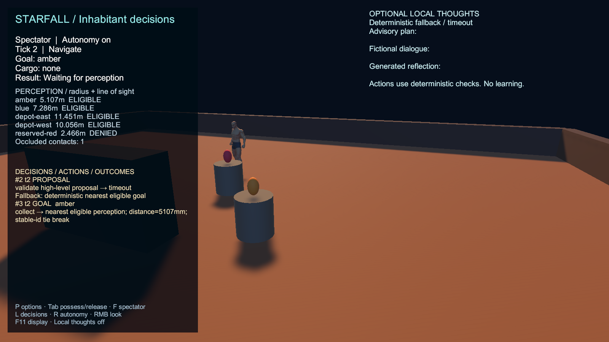
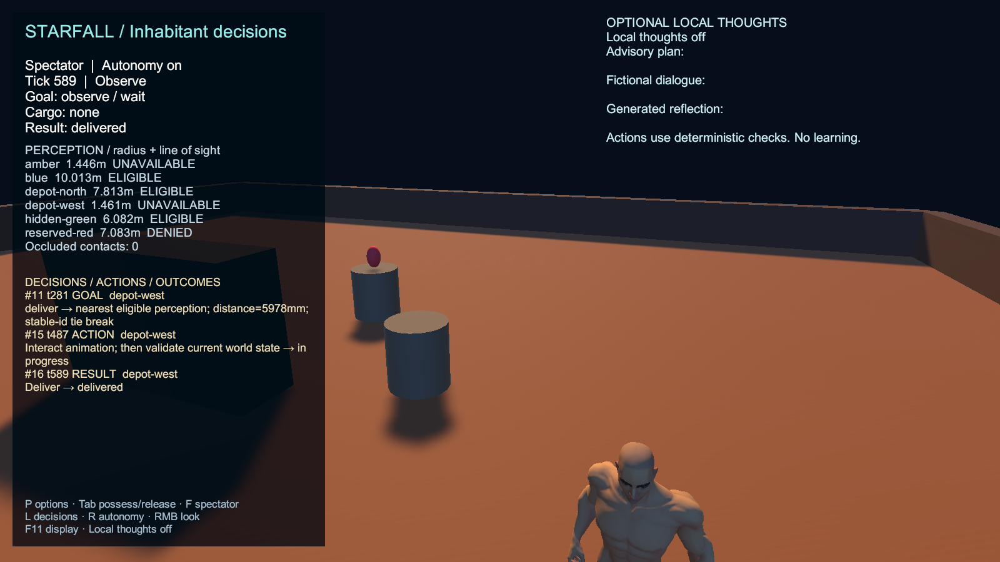

# Manual 30-second local model probe

Actual standalone player `KookerStarfallHybrid-0.0.5-preview.2-20260913-094348`, runtime source `585f2c1b2a168c5f800b6c7a84f41e4f0b4d1b29`. The user manually launched the diagnostic on 13 September 2026. All 66 checks passed with no recorded runtime errors. The real model request timed out; the inhabitant then delivered one item using deterministic fallback.

| Claim | Status | Evidence | Remaining gap |
|---|---|---|---|
| Actual diagnostic completed | PASS | [Runtime report](npc-runtime.json): 66 passing checks, no errors | Offscreen synthetic acceptance; physical input and gameplay performance are separate |
| One bounded real completion attempt | PASS | [Probe audit](real-local-probe.json): inventory returned, one completion attempted, timeout at 30003 ms | No completion HTTP response or raw reply; server inference is not established |
| Fallback selected and delivered an item | PASS | Actual PNGs below: amber selected after timeout, then depot-west delivery | One synthetic scenario |
| Real proposal, dialogue and reflection | UNVERIFIED | Audit fields empty, no admitted text; screenshots agree | Requires a completed real reply, parsing, live validation and actual display/execution |
| Reviewed copies match original run | PASS | [SHA256 manifest](review-manifest.json), four exact copies | Raw local logs remain outside reviewed source evidence |

The report's conditional text assertion can pass when no proposal is admitted. It does not prove generated text. The 50.047-second total smoke duration includes other acceptance work and is not the model latency or an FPS measurement. Normal gameplay retains its 1500 ms deadline. No model load/unload/settings request was made by this probe, and the evidence review issued no further inference request.

## Actual timeout and fallback selection

## Actual fallback delivery

